1ACC0216-TB1-20266
================
grupo2

2026-05-12

# UNIVERSIDAD PERUANA DE CIENCIAS APLICADAS

## Ciencias de la Computación

**Período:** 2026-10  
**Curso:** Fundamentos de Data Science  
**NRC:** 16310  
**Docente:** Nérida Isabel Manrique Tunque

------------------------------------------------------------------------

## Relación de integrantes

| Código     | Apellidos y nombres              |
|------------|----------------------------------|
| u202412310 | Arapa Titi Victor Piero          |
| u20241e410 | Manrique Anaya Rai Jeferson      |
| u202211741 | Neyra Salazar Alvaro Alberto     |
| U202415430 | Laurente Castrejon Josue Froilan |

------------------------------------------------------------------------

## 1. CASO DE ANALISIS

### Origen de los datos

El presente documento analiza el conjunto de datos titulado “Hotel booking demand datasets”, publicado en el año 2019 por los investigadores Nuno Antonio, Ana de Almeida y Luis Nunes en la revista científica Data in Brief. Esta base de información consolida registros de dos establecimientos hoteleros ubicados en Portugal: un hotel de tipo resort en la región del Algarve (identificado como H1) y un hotel de
entorno urbano en la ciudad de Lisboa (H2). El periodo de estudio abarca reservas con fechas de llegada programadas entre el 1 de julio de 2015 y el 31 de agosto de 2017. En total, la estructura cuenta con 31 variables
compartidas y agrupa 40,060 observaciones para el primer hotel y 79,330 para el segundo, donde cada registro equivale a una reserva individual.

Respecto al método de recolección, los registros provienen de fuentes operativas reales. Los investigadores extrajeron la información mediante consultas TSQL ejecutadas de manera directa en las bases de datos SQL de los sistemas de gestión de propiedades (PMS) de ambos hoteles. Para asegurar la confidencialidad, el procedimiento incluyó la supresión de cualquier dato sensible capaz de revelar la identidad de los clientes o de las empresas corporativas. El uso de registros administrativos operativos confiere a la muestra una alta credibilidad técnica, ya que refleja transacciones comerciales exactas del sector turístico en lugar de estimaciones o encuestas de percepción. Es importante precisar una particularidad sobre el archivo empleado para este análisis. Si bien la fuente original posee un carácter fáctico, el archivo asignado para el desarrollo de esta evaluación académica presenta alteraciones deliberadas. Los responsables del curso introdujeron ruido estadístico en el sistema, específicamente a través de valores nulos (NA) y datos atípicos (outliers). Esta característica tiene como objetivo pedagógico principal simular escenarios reales de bases de datos imperfectas y forzar la aplicación de metodologías de limpieza, preprocesamiento y validación previas a la etapa de exploración.

### Casos de uso aplicable

¿Quién podría estar interesado en este análisis?

El análisis de esta base de datos resulta de alto valor estratégico para diversos actores dentro de la industria del turismo. Principalmente, el sector hotelero y los especialistas en gestión de ingresos (Revenue Management requieren este tipo de información para comprender la dinámica real de sus establecimientos. Asimismo, los departamentos de marketing y ventas representan un grupo de interés fundamental, pues necesitan segmentar los consumidores para diseñar campañas precisas.
Adicionalmente, las agencias de viajes y las plataformas de reservas en línea (OTAs) pueden extraer métricas clave de estos registros para ajustar sus ofertas comerciales. A nivel investigativo, la disponibilidad de estos datos soluciona una carencia histórica en el sector, donde tradicionalmente los analistas han dependido de formatos exclusivos de la industria aeronáutica (como el Passenger Name Record o PNR), los cuales no logran capturar las particularidades operativas del rubro de la hotelería.

¿Qué problemas o necesidades responde este análisis?

Respecto a las necesidades que este análisis logra resolver, el enfoque principal aborda la creación de modelos predictivos para anticipar la cancelación de reservas. Al registrar el estado de las variables un día antes de la fecha programada de llegada, los analistas evitan el sesgo de información futura y obtienen cálculos precisos sobre la probabilidad de anulación de un servicio. Más allá de esta aplicación central, la amplitud de los atributos permite a los hoteles solucionar problemas de pronóstico de demanda a corto y largo plazo, encontrar anomalías, comprender patrones segmentar clientes, comprender la satisfacción del cliente con dicho servicio. Con esta evidencia las empresas turísticas logran optimizar y establecer precios dinámicos según la temporada, y tomar decisiones informadas sobre la asignación de personal, la gestión del inventario y las campañas de marketing. El valor intrínseco de esta información, la actual escasez de datos corporativos reales otorga a estos registros un papel fundamental para la investigación en áreas como, el Machine Learning al poder comparar los modelos de predicción con resultados ya conocidos, y en cuanto al rendimiento de diferentes algoritmos enfocados en resolver el mismo tipo de problema En el ámbito académico, los educadores e investigadores pueden aprovechar estos datos para estadística, para algoritmos de clasificación o segmentación y minería de datos.

## 2. CONJUNTO DE DATOS DATA SET
### 2.1 DESCRIPCION DEL DATASE

A continuación, se presenta una descripción detallada de las 31 variables compartidas que componen el conjunto de datos. Este desglose es fundamental para comprender la estructura de los atributos y preparar
las fases posteriores de limpieza y análisis exploratorio:

| Variable                    | Tipo        | Descripción breve      |
|-----------------------------|-------------|------------------------|
| ADR                         | Numeric     | Tarifa diaria promedio |
| Adults                      | Integer     | Adultos en reserva     |
| Agent                       | Categorical | Agencia de viaje       |
| ArrivalDateDayOfMonth       | Integer     | Día de llegada         |
| ArrivalDateMonth            | Categorical | Mes de llegada         |
| ArrivalDateWeekNumber       | Integer     | Semana del año         |
| ArrivalDateYear             | Integer     | Año de llegada         |
| AssignedRoomType            | Categorical | Habitación asignada    |
| Babies                      | Integer     | Bebés en reserva       |
| BookingChanges              | Integer     | Cambios en reserva     |
| Children                    | Integer     | Niños en reserva       |
| Company                     | Categorical | Empresa asociada       |
| Country                     | Categorical | País de origen         |
| CustomerType                | Categorical | Tipo de cliente        |
| DaysInWaitingList           | Integer     | Días en espera         |
| DepositType                 | Categorical | Tipo de depósito       |
| DistributionChannel         | Categorical | Canal de venta         |
| IsCanceled                  | Categorical | Cancelación (0/1)      |
| IsRepeatedGuest             | Categorical | Cliente recurrente     |
| LeadTime                    | Integer     | Anticipación (días)    |
| MarketSegment               | Categorical | Segmento de mercado    |
| Meal                        | Categorical | Tipo de comida         |
| PreviousBookingsNotCanceled | Integer     | Reservas previas OK    |
| PreviousCancellations       | Integer     | Cancelaciones previas  |
| RequiredCarParkingSpaces    | Integer     | Estacionamientos       |
| ReservationStatus           | Categorical | Estado de reserva      |
| ReservationStatusDate       | Date        | Fecha estado           |
| ReservedRoomType            | Categorical | Habitación reservada   |
| StaysInWeekendNights        | Integer     | Noches fin de semana   |
| StaysInWeekNights           | Integer     | Noches entre semana    |
| TotalOfSpecialRequests      | Integer     | Solicitudes especiales |

## 3 ANALISIS EXPLORATORIO

### 3.1.Carga de datos  

Como fase preparatoria para el análisis, se procedió a limpiar el entorno de trabajo en RStudio. Esta acción elimina variables residuales de la memoria y evita conflictos con la información nueva. Posteriormente, se habilitaron las librerías estructurales del proyecto:`tidyverse`, ecosistema principal para la manipulación y exploración de datos, y`patchwork\`,
herramienta necesaria para la futura composición visual.

``` r
#Preparación del entorno
#install.packages('rstatix')
#install.packages("tinytex")
rm(list = ls(all= TRUE))
graphics.off()

#Carga de librerías
library(tidyverse) 
```

    ## ── Attaching core tidyverse packages ──────────────────────── tidyverse 2.0.0 ──
    ## ✔ dplyr     1.2.0     ✔ readr     2.2.0
    ## ✔ forcats   1.0.1     ✔ stringr   1.6.0
    ## ✔ ggplot2   4.0.2     ✔ tibble    3.3.1
    ## ✔ lubridate 1.9.5     ✔ tidyr     1.3.2
    ## ✔ purrr     1.2.1     
    ## ── Conflicts ────────────────────────────────────────── tidyverse_conflicts() ──
    ## ✖ dplyr::filter() masks stats::filter()
    ## ✖ dplyr::lag()    masks stats::lag()
    ## ℹ Use the conflicted package (<http://conflicted.r-lib.org/>) to force all conflicts to become errors

``` r
library(patchwork)
library(rstatix)
```

    ## 
    ## Adjuntando el paquete: 'rstatix'
    ## 
    ## The following object is masked from 'package:stats':
    ## 
    ##     filter

``` r
library(paletteer)
library(scales)
```

    ## 
    ## Adjuntando el paquete: 'scales'
    ## 
    ## The following object is masked from 'package:purrr':
    ## 
    ##     discard
    ## 
    ## The following object is masked from 'package:readr':
    ## 
    ##     col_factor

``` r
# Configuración de directorio 
# (Nota: En R Markdown el directorio por defecto es la ubicación del archivo .Rmd)
setwd("C:/Users/HP/Documents/r")
```

Una vez establecido el directorio de trabajo local, se implementó una rutina de validación sobre el archivo fuente (hotel_bookings.csv).
Mediante la lectura exclusiva de la primera línea de texto, el código evaluó el tipo de delimitador presente. El sistema confirmó el uso de la coma (,), formato estándar inglés. Con el formato validado, se ejecutó la importación definitiva del conjunto de datos a la variable df a través de la función read.csv(). Para garantizar la lectura correcta de los encabezados y prevenir conversiones automáticas que alteren la naturaleza del texto, se aplicaron de forma estricta los parámetros header = TRUE y stringsAsFactors = FALSE.

``` r
#  Validación del separador de CSV
primera_linea <- readLines("hotel_bookings.csv", n = 1)

if (grepl(",", primera_linea)) {
  print("Separador formato estándar inglés") 
} else if (grepl(";", primera_linea)) {
  print("Separador formato estándar hispano")
} else {
  print("Formato de separador desconocido")
}
```

    ## [1] "Separador formato estándar inglés"

``` r
#  Lectura del archivo
df <- read.csv("hotel_bookings.csv", header = TRUE, stringsAsFactors = FALSE)
```

### 3.2. Inspeccion de datos

#### 3.2.1. Verificar cantidad de columnas y filas

Para comprender la dimensión del conjunto de datos, se aplicaron funciones de exploración básica. Esto permitió conocer la cantidad de filas y columnas, los nombres de las variables y un resumen inicial de la información importada.

Para conocer la dimensión del dataset, se utiliza la función dim(df), la cual devuelve un vector con dos valores: el número de filas (observaciones) y el número de columnas (variables). Esta información es fundamental para entender el tamaño del conjunto de datos y tener una idea inicial de su escala.

``` r
# Verificamos el número de columnas y filas 
dim(df)
```

    ## [1] 119390     32

#### 3.2.2. Visualizar los datos iniciales

Para obtener una vista preliminar del dataset, se emplea la función head(df), la cual muestra las primeras seis filas. Esto permite observar la estructura de los datos, identificar posibles valores faltantes o inconsistencias, y comprender el contenido de las variables.

``` r
# Miramos un poco de los datos iniciales 
head(df)
```

    ##          hotel is_canceled lead_time arrival_date_year arrival_date_month
    ## 1 Resort Hotel           0       342              2015               July
    ## 2 Resort Hotel           0       737              2015               July
    ## 3 Resort Hotel           0         7              2015               July
    ## 4 Resort Hotel           0        13              2015               July
    ## 5 Resort Hotel           0        14              2015               July
    ## 6 Resort Hotel           0        14              2015               July
    ##   arrival_date_week_number arrival_date_day_of_month stays_in_weekend_nights
    ## 1                       27                         1                       0
    ## 2                       27                         1                       0
    ## 3                       27                         1                       0
    ## 4                       27                         1                       0
    ## 5                       27                         1                       0
    ## 6                       27                         1                       0
    ##   stays_in_week_nights adults children babies meal country market_segment
    ## 1                    0      2        0      0   BB     PRT         Direct
    ## 2                    0      2        0      0   BB     PRT         Direct
    ## 3                    1      1        0      0   BB     GBR         Direct
    ## 4                    1      1        0      0   BB     GBR      Corporate
    ## 5                    2      2        0      0   BB     GBR      Online TA
    ## 6                    2      2        0      0   BB     GBR      Online TA
    ##   distribution_channel is_repeated_guest previous_cancellations
    ## 1               Direct                 0                      0
    ## 2               Direct                 0                      0
    ## 3               Direct                 0                      0
    ## 4            Corporate                 0                      0
    ## 5                TA/TO                 0                      0
    ## 6                TA/TO                 0                      0
    ##   previous_bookings_not_canceled reserved_room_type assigned_room_type
    ## 1                              0                  C                  C
    ## 2                              0                  C                  C
    ## 3                              0                  A                  C
    ## 4                              0                  A                  A
    ## 5                              0                  A                  A
    ## 6                              0                  A                  A
    ##   booking_changes deposit_type agent company days_in_waiting_list customer_type
    ## 1               3   No Deposit  NULL    NULL                    0     Transient
    ## 2               4   No Deposit  NULL    NULL                    0     Transient
    ## 3               0   No Deposit  NULL    NULL                    0     Transient
    ## 4               0   No Deposit   304    NULL                    0     Transient
    ## 5               0   No Deposit   240    NULL                    0     Transient
    ## 6               0   No Deposit   240    NULL                    0     Transient
    ##   adr required_car_parking_spaces total_of_special_requests reservation_status
    ## 1   0                           0                         0          Check-Out
    ## 2   0                           0                         0          Check-Out
    ## 3  75                           0                         0          Check-Out
    ## 4  75                           0                         0          Check-Out
    ## 5  98                           0                         1          Check-Out
    ## 6  98                           0                         1          Check-Out
    ##   reservation_status_date
    ## 1              2015-07-01
    ## 2              2015-07-01
    ## 3              2015-07-02
    ## 4              2015-07-02
    ## 5              2015-07-03
    ## 6              2015-07-03

#### 3.2.3.Visualizar los nombres de las columnas 

La función names(df) permite listar los nombres de todas las variables presentes en el dataset. Esto es útil para identificar las columnas disponibles y facilitar su uso en posteriores procesos de análisis y manipulación.

``` r
# Miramos los nombres de las columnas
names(df)
```

    ##  [1] "hotel"                          "is_canceled"                   
    ##  [3] "lead_time"                      "arrival_date_year"             
    ##  [5] "arrival_date_month"             "arrival_date_week_number"      
    ##  [7] "arrival_date_day_of_month"      "stays_in_weekend_nights"       
    ##  [9] "stays_in_week_nights"           "adults"                        
    ## [11] "children"                       "babies"                        
    ## [13] "meal"                           "country"                       
    ## [15] "market_segment"                 "distribution_channel"          
    ## [17] "is_repeated_guest"              "previous_cancellations"        
    ## [19] "previous_bookings_not_canceled" "reserved_room_type"            
    ## [21] "assigned_room_type"             "booking_changes"               
    ## [23] "deposit_type"                   "agent"                         
    ## [25] "company"                        "days_in_waiting_list"          
    ## [27] "customer_type"                  "adr"                           
    ## [29] "required_car_parking_spaces"    "total_of_special_requests"     
    ## [31] "reservation_status"             "reservation_status_date"

#### 3.2.4. Visualizar la estructura general del dataset 

Para analizar en detalle la estructura del dataset, se utiliza la función str(df).
Esta función muestra el tipo de dato de cada variable (numérico,carácter, factor, fecha, etc.), junto con una muestra de sus valores. Es especialmente útil para detectar si los tipos de datos son adecuados o requieren transformación.

``` r
# Exploramos los tipos de variables de las columnas
str(df)
```

    ## 'data.frame':    119390 obs. of  32 variables:
    ##  $ hotel                         : chr  "Resort Hotel" "Resort Hotel" "Resort Hotel" "Resort Hotel" ...
    ##  $ is_canceled                   : int  0 0 0 0 0 0 0 0 1 1 ...
    ##  $ lead_time                     : int  342 737 7 13 14 14 0 9 85 75 ...
    ##  $ arrival_date_year             : int  2015 2015 2015 2015 2015 2015 2015 2015 2015 2015 ...
    ##  $ arrival_date_month            : chr  "July" "July" "July" "July" ...
    ##  $ arrival_date_week_number      : int  27 27 27 27 27 27 27 27 27 27 ...
    ##  $ arrival_date_day_of_month     : int  1 1 1 1 1 1 1 1 1 1 ...
    ##  $ stays_in_weekend_nights       : int  0 0 0 0 0 0 0 0 0 0 ...
    ##  $ stays_in_week_nights          : int  0 0 1 1 2 2 2 2 3 3 ...
    ##  $ adults                        : int  2 2 1 1 2 2 2 2 2 2 ...
    ##  $ children                      : int  0 0 0 0 0 0 0 0 0 0 ...
    ##  $ babies                        : int  0 0 0 0 0 0 0 0 0 0 ...
    ##  $ meal                          : chr  "BB" "BB" "BB" "BB" ...
    ##  $ country                       : chr  "PRT" "PRT" "GBR" "GBR" ...
    ##  $ market_segment                : chr  "Direct" "Direct" "Direct" "Corporate" ...
    ##  $ distribution_channel          : chr  "Direct" "Direct" "Direct" "Corporate" ...
    ##  $ is_repeated_guest             : int  0 0 0 0 0 0 0 0 0 0 ...
    ##  $ previous_cancellations        : int  0 0 0 0 0 0 0 0 0 0 ...
    ##  $ previous_bookings_not_canceled: int  0 0 0 0 0 0 0 0 0 0 ...
    ##  $ reserved_room_type            : chr  "C" "C" "A" "A" ...
    ##  $ assigned_room_type            : chr  "C" "C" "C" "A" ...
    ##  $ booking_changes               : int  3 4 0 0 0 0 0 0 0 0 ...
    ##  $ deposit_type                  : chr  "No Deposit" "No Deposit" "No Deposit" "No Deposit" ...
    ##  $ agent                         : chr  "NULL" "NULL" "NULL" "304" ...
    ##  $ company                       : chr  "NULL" "NULL" "NULL" "NULL" ...
    ##  $ days_in_waiting_list          : int  0 0 0 0 0 0 0 0 0 0 ...
    ##  $ customer_type                 : chr  "Transient" "Transient" "Transient" "Transient" ...
    ##  $ adr                           : num  0 0 75 75 98 ...
    ##  $ required_car_parking_spaces   : int  0 0 0 0 0 0 0 0 0 0 ...
    ##  $ total_of_special_requests     : int  0 0 0 0 1 1 0 1 1 0 ...
    ##  $ reservation_status            : chr  "Check-Out" "Check-Out" "Check-Out" "Check-Out" ...
    ##  $ reservation_status_date       : chr  "2015-07-01" "2015-07-01" "2015-07-02" "2015-07-02" ...

#### 3.2.5. Resumen general del dataset

La función summary(df) proporciona un resumen estadístico de cada variable. Para variables numéricas, muestra medidas como el valor mínimo, máximo, media, mediana y cuartiles. Para variables categóricas, indica la frecuencia de cada categoría. Este análisis permite obtener una visión general del comportamiento de los datos e identificar posibles anomalías como valores extremos o distribuciones atípicas.

``` r
# Vemos un resumen general de nuestros datos 
summary(df)
```

    ##     hotel            is_canceled       lead_time   arrival_date_year
    ##  Length:119390      Min.   :0.0000   Min.   :  0   Min.   :2015     
    ##  Class :character   1st Qu.:0.0000   1st Qu.: 18   1st Qu.:2016     
    ##  Mode  :character   Median :0.0000   Median : 69   Median :2016     
    ##                     Mean   :0.3704   Mean   :104   Mean   :2016     
    ##                     3rd Qu.:1.0000   3rd Qu.:160   3rd Qu.:2017     
    ##                     Max.   :1.0000   Max.   :737   Max.   :2017     
    ##                                                                     
    ##  arrival_date_month arrival_date_week_number arrival_date_day_of_month
    ##  Length:119390      Min.   : 1.00            Min.   : 1.0             
    ##  Class :character   1st Qu.:16.00            1st Qu.: 8.0             
    ##  Mode  :character   Median :28.00            Median :16.0             
    ##                     Mean   :27.17            Mean   :15.8             
    ##                     3rd Qu.:38.00            3rd Qu.:23.0             
    ##                     Max.   :53.00            Max.   :31.0             
    ##                                                                       
    ##  stays_in_weekend_nights stays_in_week_nights     adults      
    ##  Min.   : 0.0000         Min.   : 0.0         Min.   : 0.000  
    ##  1st Qu.: 0.0000         1st Qu.: 1.0         1st Qu.: 2.000  
    ##  Median : 1.0000         Median : 2.0         Median : 2.000  
    ##  Mean   : 0.9276         Mean   : 2.5         Mean   : 1.856  
    ##  3rd Qu.: 2.0000         3rd Qu.: 3.0         3rd Qu.: 2.000  
    ##  Max.   :19.0000         Max.   :50.0         Max.   :55.000  
    ##                                                               
    ##     children           babies              meal             country         
    ##  Min.   : 0.0000   Min.   : 0.000000   Length:119390      Length:119390     
    ##  1st Qu.: 0.0000   1st Qu.: 0.000000   Class :character   Class :character  
    ##  Median : 0.0000   Median : 0.000000   Mode  :character   Mode  :character  
    ##  Mean   : 0.1039   Mean   : 0.007949                                        
    ##  3rd Qu.: 0.0000   3rd Qu.: 0.000000                                        
    ##  Max.   :10.0000   Max.   :10.000000                                        
    ##  NA's   :4                                                                  
    ##  market_segment     distribution_channel is_repeated_guest
    ##  Length:119390      Length:119390        Min.   :0.00000  
    ##  Class :character   Class :character     1st Qu.:0.00000  
    ##  Mode  :character   Mode  :character     Median :0.00000  
    ##                                          Mean   :0.03191  
    ##                                          3rd Qu.:0.00000  
    ##                                          Max.   :1.00000  
    ##                                                           
    ##  previous_cancellations previous_bookings_not_canceled reserved_room_type
    ##  Min.   : 0.00000       Min.   : 0.0000                Length:119390     
    ##  1st Qu.: 0.00000       1st Qu.: 0.0000                Class :character  
    ##  Median : 0.00000       Median : 0.0000                Mode  :character  
    ##  Mean   : 0.08712       Mean   : 0.1371                                  
    ##  3rd Qu.: 0.00000       3rd Qu.: 0.0000                                  
    ##  Max.   :26.00000       Max.   :72.0000                                  
    ##                                                                          
    ##  assigned_room_type booking_changes   deposit_type          agent          
    ##  Length:119390      Min.   : 0.0000   Length:119390      Length:119390     
    ##  Class :character   1st Qu.: 0.0000   Class :character   Class :character  
    ##  Mode  :character   Median : 0.0000   Mode  :character   Mode  :character  
    ##                     Mean   : 0.2211                                        
    ##                     3rd Qu.: 0.0000                                        
    ##                     Max.   :21.0000                                        
    ##                                                                            
    ##    company          days_in_waiting_list customer_type           adr         
    ##  Length:119390      Min.   :  0.000      Length:119390      Min.   :  -6.38  
    ##  Class :character   1st Qu.:  0.000      Class :character   1st Qu.:  69.29  
    ##  Mode  :character   Median :  0.000      Mode  :character   Median :  94.58  
    ##                     Mean   :  2.321                         Mean   : 101.83  
    ##                     3rd Qu.:  0.000                         3rd Qu.: 126.00  
    ##                     Max.   :391.000                         Max.   :5400.00  
    ##                                                                              
    ##  required_car_parking_spaces total_of_special_requests reservation_status
    ##  Min.   :0.00000             Min.   :0.0000            Length:119390     
    ##  1st Qu.:0.00000             1st Qu.:0.0000            Class :character  
    ##  Median :0.00000             Median :0.0000            Mode  :character  
    ##  Mean   :0.06252             Mean   :0.5714                              
    ##  3rd Qu.:0.00000             3rd Qu.:1.0000                              
    ##  Max.   :8.00000             Max.   :5.0000                              
    ##                                                                          
    ##  reservation_status_date
    ##  Length:119390          
    ##  Class :character       
    ##  Mode  :character       
    ##                         
    ##                         
    ##                         
    ## 

## 3.3. PRE-PROCESAMIENTO DE LOS DATOS

#### 3.3.1. Limpieza de datos 

Como primera etapa del pre-procesamiento, se abordó la identificación de datos faltantes. Para garantizar una
lectura uniforme en toda la estructura, el cód..igo estandarizó los campos de texto vacíos y las cadenas “NULL”, las cuales fueron transformadas al formato matemático NA a través del ecosistema tidyverse. Esta acción es crucial para que las funciones de evaluación de R detecten de manera precisa las ausencias de información, ya que los valores numéricos vacíos adoptan este formato por defecto. A continuación, se cuantificó el total de valores nulos reales por cada columna mediante la función colSums.

El sistema imprimió en consola únicamente las variables con deficiencias de datos para enfocar la limpieza.

``` r
# Estandarizamos los textos vacíos a formato NA matemático
df <- df %>%
  mutate(across(where(is.character), ~na_if(na_if(.x, ""), "NULL")))

# Contamos todos los NAs reales de la tabla
valores_nulos <- colSums(is.na(df))

print("Columnas con valores nulos:")
```

    ## [1] "Columnas con valores nulos:"

``` r
print(valores_nulos[valores_nulos > 0])
```

    ## children  country    agent  company 
    ##        4      488    16340   112593

Con el objetivo de preservar la integridad del volumen muestral y evitar la eliminación de registros útiles, se desestimó el borrado de filas. En su lugar, se aplicaron técnicas de imputación específicas según la
naturaleza operativa de cada variable afectada:

- Variable children: Se reemplazaron las observaciones nulas con el valor de la mediana matemática (0). Se eligió esta medida de tendencia central por ser robusta ante valores extremos.

- Variables agent y company: En el contexto hotelero, la ausencia de estos identificadores indica una reserva realizada de manera directa por el cliente. Por lo tanto, se rellenaron dichos espacios con el carácter “0”.

- Variable country: Las celdas geográficas vacías se etiquetaron bajo la categoría “Unknown” para mantener un registro estructurado de las procedencias no identificadas sin generar errores en futuras visualizaciones.

Como paso final de esta fase, se ejecutó una validación de control para confirmar la ausencia total de valores NA en la base de datos resultante.

``` r
# Aplicamos técnicas de imputación para no perder filas de información valiosa
df <- df %>%
  mutate(
    # Para la variable numérica 'children', imputamos con la mediana (0)
    children = replace_na(children, median(children, na.rm = TRUE)),
    
    # Para agent y company NA significa reserva directa. Rellenamos con "0"
    agent = replace_na(agent, "0"),
    company = replace_na(company, "0"),
    
    # Para country reemplazamos los vacíos con la etiqueta "Unknown"
    country = replace_na(country, "Unknown")
  )

# Verificamos que ya no queden NAs
print("Total de NAs restantes tras imputación:")
```

    ## [1] "Total de NAs restantes tras imputación:"

``` r
sum(is.na(df)) # Debería imprimir 0
```

    ## [1] 0

------------------------------------------------------------------------

#### 3.3.2. Transformacion de varaibles

Antes de buscar los valores atípicos (*outliers*), se revisó la estructura de los datos. Mantener los datos en su estado genérico original afecta el análisis, porque el sistema trataría de calcular promedios o máximos en columnas que en realidad funcionan como categorías finitas (estados nominales, categorías de infraestructura o identificadores binarios).

Para evitar errores, se transformaron estas variables a formato `Factor` y se ajustó el formato de fecha nativo.

Bloque 1: Categorías de Texto e Identificadores numéricos
(Transformación a Factor)

- hotel: Indica si es un “Resort” o un “City Hotel”. Su cambio a factor permite usar esta columna para agrupar los datos más adelante.
- arrival_date_month: Al pasarlo a factor, R lo entiende como doce categorías (de enero a diciembre), paso clave para el análisis de temporadas. 
- meal, deposit_type y customer_type: Definen el tipo de
comida, el método de garantía y el perfil del cliente. Funcionan como
listas cerradas de opciones, por lo cual requieren formato categórico.
-country: Indica el país de origen. Su cambio a factor ayuda a agrupar
reservas por región. -market_segment y distribution_channel: Son
categorías fijas para comparar el origen de las reservas y los canales
de venta. -reserved_room_type y assigned_room_type: Identifican los
códigos de las habitaciones. Representan opciones finitas del hotel, no
texto libre. -reservation_status: Muestra el estado final (cancelado,
check-out). Es la categoría de resultado del negocio. -agent y company:
R los lee como números, pero corresponden a códigos de agencias o
empresas corporativas. El cambio a factor evita que el programa intente
sumar o promediar estos identificadores.

Bloque 2: Variables Binarias y Fechas separadas (De Entero a Factor)

-is_canceled e is_repeated_guest: Vienen como 0 y 1, pero significan un
“Sí” o un “No”. Pasarlas a factor evita que R detecte outliers numéricos
falsos en ellas. -arrival_date_year, arrival_date_week_number y
arrival_date_day_of_month: Representan el año, la semana y el día. Como
son periodos de tiempo fijos y no cantidades matemáticas continuas, se
protegen con el formato de factor. Un año o una semana no tienen valores
atípicos.

Bloque 3: Formato de Fecha

-reservation_status_date: Se transformó de texto plano al formato de
fecha oficial en R (Date) para crear gráficos de líneas de tiempo de
forma correcta.

``` r
# 1. Variables de texto e IDs que funcionan como Categorías (Factores)
cols_chr_a_factor <- c("hotel", "arrival_date_month", "meal", "country", 
                       "market_segment", "distribution_channel", "reserved_room_type", 
                       "assigned_room_type", "deposit_type", "customer_type", 
                       "reservation_status", "agent", "company")

# 2. Variables numéricas que son Binarias o Periodos temporales finitos (Factores)
cols_int_a_factor <- c("is_canceled", "is_repeated_guest", "arrival_date_year", 
                       "arrival_date_week_number", "arrival_date_day_of_month")

# Aplicamos las transformaciones
df <- df %>%
  mutate(across(all_of(c(cols_chr_a_factor, cols_int_a_factor)), as.factor)) %>%
  mutate(reservation_status_date = as.Date(reservation_status_date))
```

``` r
print("Estructura actualizada:")
```

    ## [1] "Estructura actualizada:"

``` r
str(df)
```

    ## 'data.frame':    119390 obs. of  32 variables:
    ##  $ hotel                         : Factor w/ 2 levels "City Hotel","Resort Hotel": 2 2 2 2 2 2 2 2 2 2 ...
    ##  $ is_canceled                   : Factor w/ 2 levels "0","1": 1 1 1 1 1 1 1 1 2 2 ...
    ##  $ lead_time                     : int  342 737 7 13 14 14 0 9 85 75 ...
    ##  $ arrival_date_year             : Factor w/ 3 levels "2015","2016",..: 1 1 1 1 1 1 1 1 1 1 ...
    ##  $ arrival_date_month            : Factor w/ 12 levels "April","August",..: 6 6 6 6 6 6 6 6 6 6 ...
    ##  $ arrival_date_week_number      : Factor w/ 53 levels "1","2","3","4",..: 27 27 27 27 27 27 27 27 27 27 ...
    ##  $ arrival_date_day_of_month     : Factor w/ 31 levels "1","2","3","4",..: 1 1 1 1 1 1 1 1 1 1 ...
    ##  $ stays_in_weekend_nights       : int  0 0 0 0 0 0 0 0 0 0 ...
    ##  $ stays_in_week_nights          : int  0 0 1 1 2 2 2 2 3 3 ...
    ##  $ adults                        : int  2 2 1 1 2 2 2 2 2 2 ...
    ##  $ children                      : int  0 0 0 0 0 0 0 0 0 0 ...
    ##  $ babies                        : int  0 0 0 0 0 0 0 0 0 0 ...
    ##  $ meal                          : Factor w/ 5 levels "BB","FB","HB",..: 1 1 1 1 1 1 1 2 1 3 ...
    ##  $ country                       : Factor w/ 178 levels "ABW","AGO","AIA",..: 136 136 60 60 60 60 136 136 136 136 ...
    ##  $ market_segment                : Factor w/ 8 levels "Aviation","Complementary",..: 4 4 4 3 7 7 4 4 7 6 ...
    ##  $ distribution_channel          : Factor w/ 5 levels "Corporate","Direct",..: 2 2 2 1 4 4 2 2 4 4 ...
    ##  $ is_repeated_guest             : Factor w/ 2 levels "0","1": 1 1 1 1 1 1 1 1 1 1 ...
    ##  $ previous_cancellations        : int  0 0 0 0 0 0 0 0 0 0 ...
    ##  $ previous_bookings_not_canceled: int  0 0 0 0 0 0 0 0 0 0 ...
    ##  $ reserved_room_type            : Factor w/ 10 levels "A","B","C","D",..: 3 3 1 1 1 1 3 3 1 4 ...
    ##  $ assigned_room_type            : Factor w/ 12 levels "A","B","C","D",..: 3 3 3 1 1 1 3 3 1 4 ...
    ##  $ booking_changes               : int  3 4 0 0 0 0 0 0 0 0 ...
    ##  $ deposit_type                  : Factor w/ 3 levels "No Deposit","Non Refund",..: 1 1 1 1 1 1 1 1 1 1 ...
    ##  $ agent                         : Factor w/ 334 levels "0","1","10","103",..: 1 1 1 158 104 104 1 157 104 41 ...
    ##  $ company                       : Factor w/ 353 levels "0","10","100",..: 1 1 1 1 1 1 1 1 1 1 ...
    ##  $ days_in_waiting_list          : int  0 0 0 0 0 0 0 0 0 0 ...
    ##  $ customer_type                 : Factor w/ 4 levels "Contract","Group",..: 3 3 3 3 3 3 3 3 3 3 ...
    ##  $ adr                           : num  0 0 75 75 98 ...
    ##  $ required_car_parking_spaces   : int  0 0 0 0 0 0 0 0 0 0 ...
    ##  $ total_of_special_requests     : int  0 0 0 0 1 1 0 1 1 0 ...
    ##  $ reservation_status            : Factor w/ 3 levels "Canceled","Check-Out",..: 2 2 2 2 2 2 2 2 1 1 ...
    ##  $ reservation_status_date       : Date, format: "2015-07-01" "2015-07-01" ...

``` r
print("Resumen estadístico con niveles factorizados:")
```

    ## [1] "Resumen estadístico con niveles factorizados:"

``` r
summary(df)
```

    ##           hotel       is_canceled   lead_time   arrival_date_year
    ##  City Hotel  :79330   0:75166     Min.   :  0   2015:21996       
    ##  Resort Hotel:40060   1:44224     1st Qu.: 18   2016:56707       
    ##                                   Median : 69   2017:40687       
    ##                                   Mean   :104                    
    ##                                   3rd Qu.:160                    
    ##                                   Max.   :737                    
    ##                                                                  
    ##  arrival_date_month arrival_date_week_number arrival_date_day_of_month
    ##  August :13877      33     :  3580           17     : 4406            
    ##  July   :12661      30     :  3087           5      : 4317            
    ##  May    :11791      32     :  3045           15     : 4196            
    ##  October:11160      34     :  3040           25     : 4160            
    ##  April  :11089      18     :  2926           26     : 4147            
    ##  June   :10939      21     :  2854           9      : 4096            
    ##  (Other):47873      (Other):100858           (Other):94068            
    ##  stays_in_weekend_nights stays_in_week_nights     adults      
    ##  Min.   : 0.0000         Min.   : 0.0         Min.   : 0.000  
    ##  1st Qu.: 0.0000         1st Qu.: 1.0         1st Qu.: 2.000  
    ##  Median : 1.0000         Median : 2.0         Median : 2.000  
    ##  Mean   : 0.9276         Mean   : 2.5         Mean   : 1.856  
    ##  3rd Qu.: 2.0000         3rd Qu.: 3.0         3rd Qu.: 2.000  
    ##  Max.   :19.0000         Max.   :50.0         Max.   :55.000  
    ##                                                               
    ##     children           babies                 meal          country     
    ##  Min.   : 0.0000   Min.   : 0.000000   BB       :92310   PRT    :48590  
    ##  1st Qu.: 0.0000   1st Qu.: 0.000000   FB       :  798   GBR    :12129  
    ##  Median : 0.0000   Median : 0.000000   HB       :14463   FRA    :10415  
    ##  Mean   : 0.1039   Mean   : 0.007949   SC       :10650   ESP    : 8568  
    ##  3rd Qu.: 0.0000   3rd Qu.: 0.000000   Undefined: 1169   DEU    : 7287  
    ##  Max.   :10.0000   Max.   :10.000000                     ITA    : 3766  
    ##                                                          (Other):28635  
    ##        market_segment  distribution_channel is_repeated_guest
    ##  Online TA    :56477   Corporate: 6677      0:115580         
    ##  Offline TA/TO:24219   Direct   :14645      1:  3810         
    ##  Groups       :19811   GDS      :  193                       
    ##  Direct       :12606   TA/TO    :97870                       
    ##  Corporate    : 5295   Undefined:    5                       
    ##  Complementary:  743                                         
    ##  (Other)      :  239                                         
    ##  previous_cancellations previous_bookings_not_canceled reserved_room_type
    ##  Min.   : 0.00000       Min.   : 0.0000                A      :85994     
    ##  1st Qu.: 0.00000       1st Qu.: 0.0000                D      :19201     
    ##  Median : 0.00000       Median : 0.0000                E      : 6535     
    ##  Mean   : 0.08712       Mean   : 0.1371                F      : 2897     
    ##  3rd Qu.: 0.00000       3rd Qu.: 0.0000                G      : 2094     
    ##  Max.   :26.00000       Max.   :72.0000                B      : 1118     
    ##                                                        (Other): 1551     
    ##  assigned_room_type booking_changes       deposit_type        agent      
    ##  A      :74053      Min.   : 0.0000   No Deposit:104641   9      :31961  
    ##  D      :25322      1st Qu.: 0.0000   Non Refund: 14587   0      :16340  
    ##  E      : 7806      Median : 0.0000   Refundable:   162   240    :13922  
    ##  F      : 3751      Mean   : 0.2211                       1      : 7191  
    ##  G      : 2553      3rd Qu.: 0.0000                       14     : 3640  
    ##  C      : 2375      Max.   :21.0000                       7      : 3539  
    ##  (Other): 3530                                            (Other):42797  
    ##     company       days_in_waiting_list         customer_type  
    ##  0      :112593   Min.   :  0.000      Contract       : 4076  
    ##  40     :   927   1st Qu.:  0.000      Group          :  577  
    ##  223    :   784   Median :  0.000      Transient      :89613  
    ##  67     :   267   Mean   :  2.321      Transient-Party:25124  
    ##  45     :   250   3rd Qu.:  0.000                             
    ##  153    :   215   Max.   :391.000                             
    ##  (Other):  4354                                               
    ##       adr          required_car_parking_spaces total_of_special_requests
    ##  Min.   :  -6.38   Min.   :0.00000             Min.   :0.0000           
    ##  1st Qu.:  69.29   1st Qu.:0.00000             1st Qu.:0.0000           
    ##  Median :  94.58   Median :0.00000             Median :0.0000           
    ##  Mean   : 101.83   Mean   :0.06252             Mean   :0.5714           
    ##  3rd Qu.: 126.00   3rd Qu.:0.00000             3rd Qu.:1.0000           
    ##  Max.   :5400.00   Max.   :8.00000             Max.   :5.0000           
    ##                                                                         
    ##  reservation_status reservation_status_date
    ##  Canceled :43017    Min.   :2014-10-17     
    ##  Check-Out:75166    1st Qu.:2016-02-01     
    ##  No-Show  : 1207    Median :2016-08-07     
    ##                     Mean   :2016-07-30     
    ##                     3rd Qu.:2017-02-08     
    ##                     Max.   :2017-09-14     
    ## 

#### 3.3.2. Identificación y manejo de filas duplicadas.

Tras realizar la identificación de variables faltantes con sus respectivas transformaciones de tipo. Se realizó una auditoría de integridad para detectar la presencia de registros idénticos dentro del conjunto de datos. Mediante la función que nos permita reconocer la cantidad de filas que se duplican, luego de esto se contabilizaron 31,994 filas duplicadas, lo que representa aproximadamente el 26 8% del dataset original.

``` r
total_duplicados <- sum(duplicated(df))
total_duplicados
```

    ## [1] 31994

Al utilizar sum(duplicated(df)) contabilizamos la cantidad de filas que tienen sus valores repetidos, sin embargo, esto no contempla que cantidad de variables tienen los mismos valores, únicamente sirve para detectar que la cantidad de elementos duplicados. De forma que las
31,994 filas representan duplicados pero no significa que el total de estas filas contienen el mismo valor. Por ello para conseguir un mejor análisis, se optó por agrupar aquellos elementos que tienen exactamente el mismo valor.

``` r
df %>%
group_by_all() %>%          # agrupa por todas las columnas
summarise(veces = n()) %>%  # cuenta cuantas veces aparece cada combinacion
filter(veces > 1) %>%       # solo los que se repiten
arrange(desc(veces)) %>% 
  head()
```

    ## `summarise()` has regrouped the output.
    ## ℹ Summaries were computed grouped by hotel, is_canceled, lead_time,
    ##   arrival_date_year, arrival_date_month, arrival_date_week_number,
    ##   arrival_date_day_of_month, stays_in_weekend_nights, stays_in_week_nights,
    ##   adults, children, babies, meal, country, market_segment,
    ##   distribution_channel, is_repeated_guest, previous_cancellations, …,
    ##   reservation_status, and reservation_status_date.
    ## ℹ Output is grouped by hotel, is_canceled, lead_time, arrival_date_year,
    ##   arrival_date_month, arrival_date_week_number, arrival_date_day_of_month,
    ##   stays_in_weekend_nights, stays_in_week_nights, adults, children, babies,
    ##   meal, country, market_segment, distribution_channel, is_repeated_guest,
    ##   previous_cancellations, …, total_of_special_requests, and reservation_status.
    ## ℹ Use `summarise(.groups = "drop_last")` to silence this message.
    ## ℹ Use `summarise(.by = c(hotel, is_canceled, lead_time, arrival_date_year,
    ##   arrival_date_month, arrival_date_week_number, arrival_date_day_of_month,
    ##   stays_in_weekend_nights, stays_in_week_nights, adults, children, babies,
    ##   meal, country, market_segment, distribution_channel, is_repeated_guest,
    ##   previous_cancellations, previous_bookings_not_canceled, reserved_room_type,
    ##   assigned_room_type, booking_changes, deposit_type, agent, company,
    ##   days_in_waiting_list, customer_type, adr, required_car_parking_spaces,
    ##   total_of_special_requests, reservation_status, reservation_status_date))` for
    ##   per-operation grouping (`?dplyr::dplyr_by`) instead.

    ## # A tibble: 6 × 33
    ## # Groups:   hotel, is_canceled, lead_time, arrival_date_year,
    ## #   arrival_date_month, arrival_date_week_number, arrival_date_day_of_month,
    ## #   stays_in_weekend_nights, stays_in_week_nights, adults, children, babies,
    ## #   meal, country, market_segment, distribution_channel, is_repeated_guest,
    ## #   previous_cancellations, previous_bookings_not_canceled, reserved_room_type,
    ## #   assigned_room_type, booking_changes, deposit_type, agent, company,
    ## #   days_in_waiting_list, customer_type, adr, required_car_parking_spaces,
    ## #   total_of_special_requests, reservation_status [6]
    ##   hotel      is_canceled lead_time arrival_date_year arrival_date_month
    ##   <fct>      <fct>           <int> <fct>             <fct>             
    ## 1 City Hotel 1                 277 2016              November          
    ## 2 City Hotel 1                  68 2016              February          
    ## 3 City Hotel 1                 188 2016              June              
    ## 4 City Hotel 1                 158 2016              May               
    ## 5 City Hotel 1                  34 2015              December          
    ## 6 City Hotel 1                  28 2017              March             
    ## # ℹ 28 more variables: arrival_date_week_number <fct>,
    ## #   arrival_date_day_of_month <fct>, stays_in_weekend_nights <int>,
    ## #   stays_in_week_nights <int>, adults <int>, children <int>, babies <int>,
    ## #   meal <fct>, country <fct>, market_segment <fct>,
    ## #   distribution_channel <fct>, is_repeated_guest <fct>,
    ## #   previous_cancellations <int>, previous_bookings_not_canceled <int>,
    ## #   reserved_room_type <fct>, assigned_room_type <fct>, …

De esta forma podemos explorar la cantidad de elementos que se repiten dentro de un grupo asociado, esto sirve para determinar que no todos las filas repetidas son las mismas. Con esto se puede reconocer que existen grupos que contienen hasta 180 elementos que son iguales y en otros casos llegan a tener 9 filas con elementos duplicados.

Estos valores son importantes para definir el tratamiento que tendrán estas filas para el análisis. Como pudo verse los duplicados no representan valores de una única fila, además se reconoce que el dataset no cuenta con una variable de tipo “ID_Reserva” o Clave Primaria que garantice que dos registros iguales son, en efecto, la misma transacción. Por esta razón se ha optado por mantener las filas, debido a la dificultad por distinguir algún identificador. Además, en hoteles de alta capacidad (City Hotels) y estandarización de servicios, es estadísticamente posible que dos huéspedes distintos realicen reservas con características idénticas (mismo mes, misma duración, mismo tipo de cliente y misma tarifa),especialmente en fechas de alta demanda o mediante canales de distribución masivos (agencias de viaje). Por tal, eliminar estos registros sin una prueba inequívoca de error podría subestimar la demanda real y alterar los cálculos de estacionalidad y ocupación.

#### 3.3.3. Selección de datos de interés

Antes de empezar con el procesamiento de los datos es necesario revisar la relevancia de las variables de cada columna. Dado que se necesita hacer el análisis de
acuerdo a las solicitudes planteadas en el proyecto. Después de una revisión exhaustiva se ha seleccionado un total de 11 columnas, estas a su vez pueden ser agrupadas en dos grupos: columnas de valores numéricos y columnas de tipo factor.

##### 3.3.3.1 Reducción de Dimensionalidad (Variables Categóricas) 

Como paso previo a la reducción de dimensionalidad, se inspeccionó la distribución de los factores para justificar su posible exclusión del conjunto de datos de forma técnica y operativa.

**Variables de Alta Fragmentación (Cardinalidad)**

El primer grupo de posibles variables descartadas corresponde a aquellas con una
distribución excesiva de categorías. Mantener columnas con cientos de opciones distintas dispersa la información y vuelve inviable la creación de agrupaciones visuales claras. Para evidenciar el nivel de fragmentación en el entorno de RStudio, se ejecutó la función nlevels(), la cual cuantifica el total de niveles únicos presentes en cada factor:

``` r
# Inspección de cardinalidad en variables categóricas
nlevels(df$agent)
```

    ## [1] 334

``` r
nlevels(df$company)
```

    ## [1] 353

``` r
nlevels(df$country)
```

    ## [1] 178

La salida de consola confirmó la presencia de 334, 353 y 178 categorías
respectivamente. En base a esta evidencia numérica, se determina la
eliminación de las siguientes variables:

- **Identificador de Agencia (agent):** La base de datos registra 334
códigos distintos de agencias de viajes. El objetivo del trabajo es
evaluar la demanda, las cancelaciones y la duración de las estancias. El
código exacto del intermediario comercial representa un dato
administrativo que no aporta valor para responder las preguntas de
negocio.

- **Identificador Corporativo (company):** Con 353 categorías únicas,
esta variable funciona como un registro interno de las empresas que
pagan las reservas. Al igual que el identificador de agencia, es un dato
cerrado que solo genera ruido estructural y carece de relevancia para
estudiar el comportamiento general del huésped.

- **País de Origen (country):** La información geográfica se fragmenta
en 178 naciones distintas. Aunque el lugar de procedencia resulta un
dato útil para estudios de marketing, el nivel de detalle actual es
demasiado granular para este análisis. Las preguntas de investigación
planteadas no solicitan segmentación por continente o país, por lo cual
se procede con su retiro para limpiar el marco de datos.

**Variables de Consumo y Logística Interna**

El segundo conjunto de datos a descartar agrupa las variables que
describen características del consumo o la asignación de inventario del
hotel. Si bien estas columnas poseen una cantidad manejable de niveles,
su naturaleza técnica no responde a los objetivos de evaluar la
estacionalidad, el volumen de demanda en el tiempo o las tendencias
macro de cancelación

- **Régimen de Alimentación (meal):**

``` r
# Inspección visual rápida
ggplot(df, aes(x = meal)) + 
  geom_bar(fill = "steelblue", color = "black") + 
  labs(title = "Distribución del Régimen de Alimentación", 
       x = "Tipo de Paquete", y = "Cantidad de Reservas") +
  theme_minimal()
```

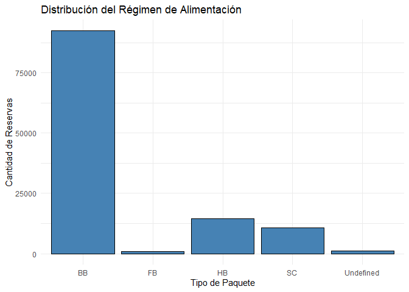<!-- -->
El análisis de frecuencias demuestra una concentración masiva de los
datos en la categoría “BB” (Bed & Breakfast). A pesar de existir una
preferencia clara, el paquete de comida contratado constituye un
indicador de consumo interno. Esta métrica resulta ineficaz para
proyectar fluctuaciones de demanda a largo plazo o para identificar
picos de estacionalidad, motivo por el cual se procede con su retiro.

- **Tipo de Habitación Reservada (reserved_room_type):**

``` r
# Cálculo de frecuencias y Gráfico Lollipop (Piruleta)
df %>%
  count(reserved_room_type) %>%
  mutate(porcentaje = n / sum(n) * 100) %>%
  ggplot(aes(x = reorder(reserved_room_type, -porcentaje), y = porcentaje)) +

  geom_segment(aes(xend = reserved_room_type, y = 0, yend = porcentaje), 
               color = "darkgray", size = 1) +

  geom_point(color = "steelblue", size = 4) +
  # agregamos el texto del porcentaje  arriba del punto
  geom_text(aes(label = sprintf("%.1f%%", porcentaje)), vjust = -1.5, size = 3.5) +
  theme_minimal() +
  labs(
    title = "Preferencia de Infraestructura: Tipo de Habitación Reservada",
    subtitle = "Concentración porcentual de la demanda por categoría de cuarto",
    x = "Código de Habitación",
    y = "Porcentaje de Demanda (%)"
  ) +
  theme(plot.title = element_text(hjust = 0.5), plot.subtitle = element_text(hjust=0.5)) +
  scale_y_continuous(expand = expansion(mult = c(0, 0.15)))
```

    ## Warning: Using `size` aesthetic for lines was deprecated in ggplot2 3.4.0.
    ## ℹ Please use `linewidth` instead.
    ## This warning is displayed once per session.
    ## Call `lifecycle::last_lifecycle_warnings()` to see where this warning was
    ## generated.

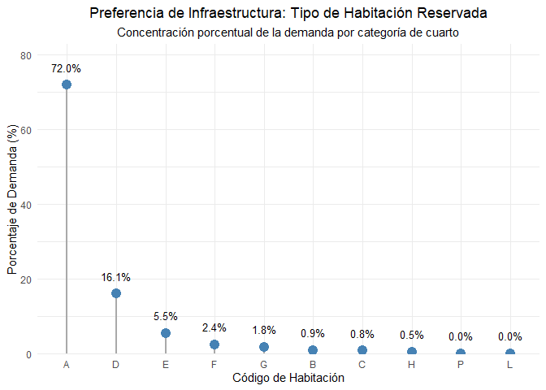

El análisis de frecuencias a través de la representación gráfica evidencia una polarización masiva en la preferencia del consumidor. La habitación de categoría estándar (tipo “A”) acapara el 72.0% de las reservas, seguida lejanamente por la categoría “D” con un 16.1%.

Desde una perspectiva de negocio, esta métrica posee un alto valor para el departamento encargado de operaciones e infraestructura del hotel, ya que permite planificar los cuartos y entender la distribución física demandado por el cliente.

Sin embargo, a pesar de su utilidad, la designación alfanumérica de la habitación constituye un detalle
logístico interno que no aporta capacidad explicativa frente a los
objetivos macro de este análisis.

- **tipo de Habitación Asignada (assigned_room_type):**

De forma idéntica a la métrica anterior, este factor expone el detalle
logístico de la entrega de llaves (permite evaluar si al usuario se le
entregó el cuarto original o si ocurrió una reasignación).

A través de
la Heat Map, se evaluó la fiabilidad del hotel en la entrega del
producto solicitado por el cliente. La diagonal del gráfico representa
la tasa de éxito operativa, donde se observa que en categorías
mayoritarias como la “A”, el hotel cumple con el pedido original en casi
su totalidad. Las celdas fuera de la diagonal revelan la frecuencia de
cambios de habitación realizados en recepción.

``` r
#  Solo reservas NO canceladas
df_exitosas <- df %>%
  filter(is_canceled == "0") %>% # Filtramos 
  count(reserved_room_type, assigned_room_type) %>%
  group_by(reserved_room_type) %>%
  mutate(porcentaje = n / sum(n) * 100) # Porcentaje de asignación por cada tipo reservado

# Generar el Heatmap
ggplot(df_exitosas, aes(x = assigned_room_type, y = reserved_room_type, fill = porcentaje)) +
  geom_tile(color = "white") +
  scale_fill_gradient(low = "#f1f7ff", high = "steelblue") +
  # Agregamos el texto del porcentaje en cada celda
  geom_text(aes(label = sprintf("%.1f%%", porcentaje)), 
            size = 3, color = ifelse(df_exitosas$porcentaje > 50, "white", "black")) +
  theme_minimal() +
  labs(
    title = "Matriz de Coincidencia: Habitación Reservada vs. Asignada",
    subtitle = "Análisis de lealtad al pedido original en reservas concretadas",
    x = "Habitación Asignada (Realidad)",
    y = "Habitación Reservada (Expectativa)",
    fill = "% de Casos"
  )+
   theme(plot.title = element_text(hjust = 0.5), plot.subtitle = element_text(hjust=0.5)) 
```

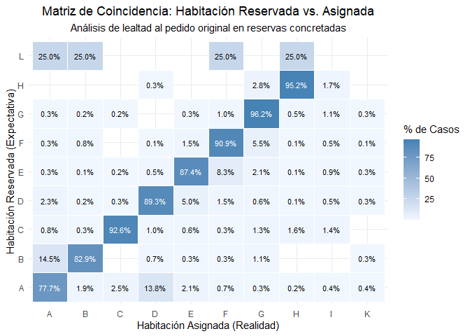<!-- -->
Sin embargo, este nivel de análisis profundiza en la calidad del
servicio y cumplimiento logístico. Aunque el gráfico demuestra una
gestión operativa eficiente. Al ser un indicador de auditoría de
servicio se determina su posible exclusión para mantener el enfoque del
proyecto. 

**Variables redundantes o del Proceso Comercial**

El último conjunto de exclusión comprende aquellas métricas que presentan
redundancia estructural o responden a tipologías de venta y contratos.
Su presencia en el modelo analítico duplica información ya capturada por
otras variables o desvía el enfoque de los objetivos principales del
trabajo.

**Tiempo** 
- **arrival_date_week_number (Semana del año)**
- **arrival_date_day_of_month (Día del mes)**

``` r
# Gráfico de  diario (Día del mes)
p_dia <- df %>%
  count(arrival_date_day_of_month) %>%
  mutate(dia = as.numeric(as.character(arrival_date_day_of_month))) %>%
  ggplot(aes(x = dia, y = n)) +
  geom_line(color = "darkgray", size = 1) +
  geom_point(color = "red", size = 2) +
  theme_minimal() +
  labs(
    title = "Histograma Dia de mes",
    subtitle = "Volatilidad por día del mes",
    x = "Día del Mes (1-31)",
    y = "Volumen de Reservas"
  )

# Gráfico de  semanal (Semana del año)
p_semana <- df %>%
  count(arrival_date_week_number) %>%
  mutate(semana = as.numeric(as.character(arrival_date_week_number))) %>%
  ggplot(aes(x = semana, y = n)) +
  geom_line(color = "darkgray", size = 1) +
  geom_point(color = "steelblue", size = 2) +
  theme_minimal() +
  labs(
    title = "Histograma num de semana del año",
    subtitle = "Volatilidad por semana del año",
    x = "Semana del Año (1-53)",
    y = "Volumen de Reservas"
  )

# Unir los gráficos 
p_dia + p_semana
```

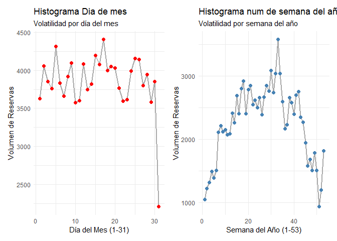<!-- -->

Para evaluar estas dimensiones métricas, se generó una inspección visual de la distribución diaria y semanal. Como se observa en ambas representaciones, el fraccionamiento del tiempo en días (1-31) o semanas (1-53) evidencia una alta volatilidad y granulidad. Los continuos picos
y caídas impiden visualizar una tendencia macro de negocio clara.

Para los objetivos estratégicos de este proyecto que requieren responder a las tendencias estacionales y las fluctuaciones de ocupación a largo plazo esta granularidad resulta excesiva e introduce ruido.

Por consiguiente, se determina la eliminación de la semana y el día del mes.

**Reduncancia de cancelacion**

- **reservation_status (Estado final: Canceled, Check-Out, No-Show):**

Para revisar la integridad de las métricas de cancelación, se procedió a
cruzar el estado operativo final del huésped (reservation_status) con la
variable indicadora (is_canceled). Previo a la representación gráfica,
se ejecutó una validación lógica para descartar discrepancias por
ejemplo, reservas marcadas como canceladas en texto, pero con un 0 en la
variable is_canceled:

``` r
df %>% 
  select( is_canceled, reservation_status) %>% 
  filter(reservation_status == "Canceled" & is_canceled == 0)
```

    ## [1] is_canceled        reservation_status
    ## <0 rows> (o 0- extensión row.names)

El retorno de cero filas confirma la ausencia de errores de registro.
Posteriormente, se visualizó la superposición mediante un gráfico de
barras agrupadas:

``` r
df %>%
  # Etiquetamos el 0 y 1 temporalmente para que la leyenda del gráfico sea clara
  mutate(is_canceled_label = factor(is_canceled, labels = c("0 (Concretada)", "1 (Anulada)"))) %>%
  ggplot(aes(x = reservation_status, fill = is_canceled_label)) +
  # Usamos position = "dodge" para poner las barras lado a lado si hubiera mezcla
  geom_bar(position = "dodge", color = "white", alpha = 0.9) +
  scale_fill_manual(values = c("0 (Concretada)" = "steelblue", "1 (Anulada)" = "#BD1100")) +
  theme_minimal() +
  labs(
    title = "Estado Final vs. Variable Binaria",
    subtitle = "Demostración de superposición exacta entre ambas métricas",
    x = "Estado Final Operativo (reservation_status)",
    y = "Volumen de Reservas",
    fill = "Variable is_canceled"
  ) +
   theme(plot.title = element_text(hjust = 0.5), plot.subtitle = element_text(hjust=0.5))
```

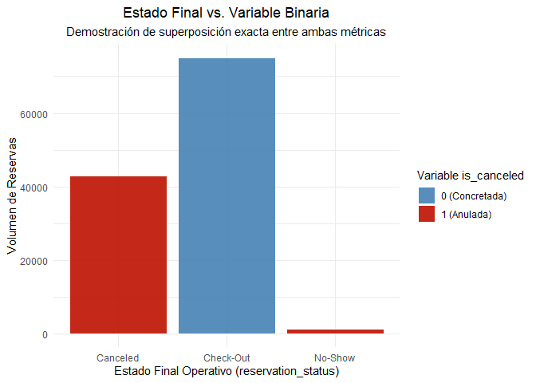<!-- -->

La representación gráfica demuestra una correspondencia matemática
exacta: la totalidad de los registros catalogados como “Check-Out”
equivalen al valor 0, mientras que las categorías “Canceled” y “No-Show”
se agrupan en su totalidad bajo el valor 1.

Por ello, mantener la
columna reservation_status en el conjunto de datos genera una
redundancia estructural (multicolinealidad). Para responder a las
preguntas planteadas se opta por su posible descarte de la variable.
Esta decisión asegura una métrica mucho más limpia.

**Variables comeriales y de contrato** 

- **market segment distribution
channel:** Este subgrupo abarca métricas relacionadas con la captación
del cliente y su perfil de compra. Dentro de este bloque, existe una
aparente redundancia entre el canal de distribución
(distribution_channel) y el segmento de mercado (market_segment).

Para
evidenciar que estas columnas no constituyen duplicados matemáticos, se
ejecutó una matriz de frecuencias cruzadas con un tabble y mediante un
Mapa de Calor (Heatmap) basado en volúmenes absolutos:

``` r
table(df$market_segment,df$distribution_channel)
```

    ##                
    ##                 Corporate Direct   GDS TA/TO Undefined
    ##   Aviation            227      0     0    10         0
    ##   Complementary        89    576     0    78         0
    ##   Corporate          4788    172     0   335         0
    ##   Direct               90  12276     1   237         2
    ##   Groups             1228   1472     0 17111         0
    ##   Offline TA/TO       212     16    45 23946         0
    ##   Online TA            43    133   147 56153         1
    ##   Undefined             0      0     0     0         2

para mejor visualizacion el heatmap

``` r
df %>%
  # Agrupamos y contamos las intersecciones
  count(market_segment, distribution_channel) %>%
  ggplot(aes(x = distribution_channel, y = market_segment, fill = n)) +
  # Dibujamos los cuadrados
  geom_tile(color = "white") +
  # Escala de colores con paletteer
  scale_fill_gradientn(
    colors = paletteer_dynamic("cartography::wine.pal", 20),
    name = "Volumen"
  ) +
  # Agregamos los números exactos
  geom_text(aes(label = n),
            color = ifelse(df %>% count(market_segment, distribution_channel) %>% pull(n) > 20000,
                           "white", "black"),
            size = 3.5) +
  theme_minimal() +
  labs(
    title = "Matriz de Frecuencias Segmento vs. Canal de Distribución",
    subtitle = "Volumen absoluto de reservas por perfil de cliente y vía de ingreso",
    x = "distribution_channel",
    y = "market_segment"
  ) +
  theme(plot.title = element_text(face = "bold", hjust = 0.5),
        plot.subtitle = element_text(hjust = 0.5))
```

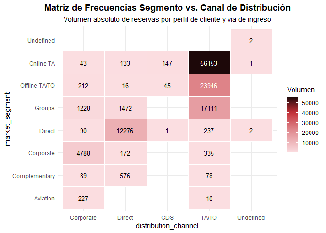<!-- -->

La representación visual y numérica confirma una interrelación compleja.
Se demuestra que los canales no son exclusivos de un solo segmento. Por
ejemplo, el inmenso volumen del segmento de Grupos (Groups) ingresa casi
en su totalidad a través del canal de agencias intermediarias (TA/TO. De
igual forma, el canal directo atiende tanto a clientes regulares como a
perfiles corporativos.

Desde una visión del negocio, esta matriz posee
un valor para los departamentos de Marketing, pues permite evaluar el
rendimiento de los canales de venta frente a perfiles específicos.

No obstante, la delimitación de este proyecto prioriza el estudio físico de la demanda hotelera.

Por consiguiente, se determina la posible exclusión
de todo este bloque comercial para consolidar un conjunto de datos
estandarizado y enfocado estrictamente en las interrogantes de
investigación

- **is_repeated_guest:** Esta variable identifica si el usuario visitó
el hotel en el pasado o si es un cliente nuevo. Para revisar este
comportamiento en ambos establecimientos, se construyó un gráfico
circular por tipo de hotel.

``` r
df %>%
  # contamos las combinaciones exactas de hotel y tipo de huésped
  count(hotel, is_repeated_guest) %>%
  # agrupamos por hotel 
  group_by(hotel) %>%
  mutate(
    tipo = ifelse(is_repeated_guest == 1, "Huésped Recurrente", "Huésped Nuevo"),
    porcentaje = n / sum(n) * 100
  ) %>%
  # desagrupamos para evitar errores en ggplot
  ungroup() %>%
  ggplot(aes(x = 2, y = porcentaje, fill = tipo)) +
  geom_col(color = "white", size = 1) +
  coord_polar(theta = "y") +
  # Redujimos un poco el tamaño de la letra (size = 3.5) porque ahora los círculos son más pequeños
  geom_text(aes(label = sprintf("%.1f%%", porcentaje)), 
            position = position_stack(vjust = 0.5), 
            color = "white", size = 3.5, fontface = "bold") +
  scale_fill_paletteer_d("ggthemes::excel_Badge") +
  # dividimos el gráfico en dos  por hotel
  facet_wrap(~ hotel) +
  theme_void() +
  labs(
    title = "Proporción de Retención por Tipo de Hotel",
    subtitle = "Distribución de clientes nuevos frente a visitantes recurrentes",
    fill = "Historial del Cliente"
  ) +
  theme(
    plot.title = element_text(face = "bold", hjust = 0.5, margin = margin(b = 5)),
    plot.subtitle = element_text(hjust = 0.5, margin = margin(b = 15)),
    legend.position = "bottom",
    # le damos formato a los títulos de arriba de cada círculo
    strip.text = element_text(face = "bold", size = 11) 
  )
```

    ## Warning in geom_col(color = "white", size = 1): Ignoring unknown parameters:
    ## `size`

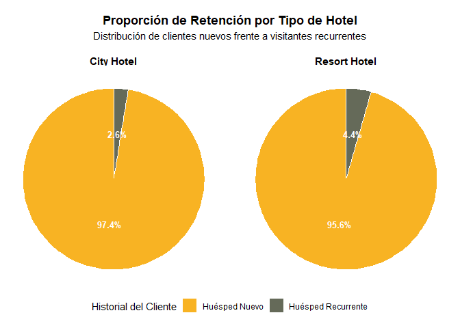<!-- -->

Los resultados muestran que casi todos los clientes realizan su primera
visita. Si bien el Resort Hotel tiene un poco más de retención que el
City Hotel, los huéspedes frecuentes representan menos del 5% en los dos
casos. 

A nivel de negocio, esta información es útil para que el área de
Marketing evalúe sus programas de fidelidad. Sin embargo, el objetivo
principal de este proyecto es analizar la demanda general y los motivos
de las cancelaciones. 

Como la gran mayoría de las reservas provienen de
usuarios nuevos, el historial individual de un cliente no aporta datos
clave para proyectar el comportamiento global del hotel. Por esta razón,
se excluye la variable del modelo final

- **(customer_type) y Garantía Financiera (deposit_type):**

``` r
print("Tipo de deposito")
```

    ## [1] "Tipo de deposito"

``` r
summary(df$deposit_type)
```

    ## No Deposit Non Refund Refundable 
    ##     104641      14587        162

``` r
print("Tipo de cliente")
```

    ## [1] "Tipo de cliente"

``` r
summary(df$customer_type)
```

    ##        Contract           Group       Transient Transient-Party 
    ##            4076             577           89613           25124

``` r
df %>%
  ggplot(aes(x = customer_type, fill = deposit_type)) +
  geom_bar(color = "white", alpha = 0.85) +
  coord_flip() +
  scale_fill_paletteer_d("ggpomological::pomological_palette") +
  theme_minimal() +
  labs(
    title = "Políticas de Depósito por Tipo de Cliente",
    subtitle = "Volumen total de reservas según el contrato y garantía exigida",
    x = "Tipo de Cliente",
    y = "Cantidad de Reservas",
    fill = "Tipo de Depósito"
  ) +
  theme(plot.title = element_text(face = "bold", hjust = 0.5),
        plot.subtitle = element_text(hjust = 0.5),
        legend.position = "bottom")
```

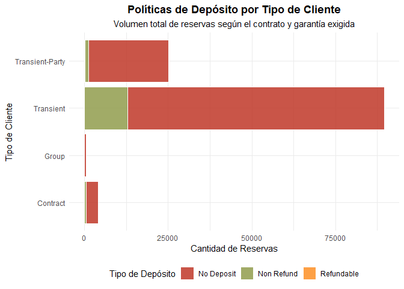<!-- -->
Indica si la reserva exigió un pago previo (con o sin depósito). Al ser
un indicador netamente contable, su impacto es irrelevante para
proyectar la ocupación física o la composición de los visitantes pero
aporta información para la detección de anomalías respecto a la variable
adr. Por consiguiente, se aprueba su retiro para consolidar un conjunto
de datos enfocado estrictamente en las preguntas de investigación.

##### 3.3.3.2 Reducción de Dimensionalidad (Variables Categóricas que se conservan)

Tras el proceso de reducción de dimensionalidad, el equipo determinó
conservar un grupo de 4 variables categóricas fundamentales. Esta
selección responde a una necesidad técnica de agrupar y segmentar los
datos para dar respuesta directa a los objetivos del negocio. A
continuación, se detalla la justificación técnica de cada variable y su
relevancia para las preguntas de investigación:

- **Análisis de la variable: hotel (Tipo de hotel)** 

La variable hotel es el eje de segmentación principal de este estudio, ya que permite distinguir entre establecimientos de tipo City Hotel y Resort Hotel. Para verificar la relevancia de esta dimensión, se ha desarrollado un gráfico de barras que cuantifica la distribución de las reservas en el conjunto de datos.

El uso de un gráfico de barras para esta variable es fundamental porque permite evaluar la representatividad de la muestra. Al ser un estudio que busca identificar patrones de demanda y estacionalidad, es vital confirmar que contamos con un volumen de datos suficiente en ambos tipos de hoteles para que las comparaciones posteriores (como el cálculo de duración de estancia o ingresos
promedio) sean estadísticamente significativas y no presenten sesgos hacia un solo modelo de negocio.

Por ello en R implementamos este código para realizar el gráfico de barras representativo:

``` r
ggplot(df, aes(x = hotel, fill = hotel)) +
  geom_bar(color = "black", alpha = 0.8) +
  geom_text(stat = 'count', aes(label = after_stat(count)), vjust = -0.5) +
  scale_fill_manual(values = c("City Hotel" = "steelblue", "Resort Hotel" = "darkorange")) +
  labs(title = "Distribución de Reservas por Tipo de Hotel",
       subtitle = "Comparativa de preferencia de los usuarios entre City y Resort Hotel",
       x = "Tipo de Establecimiento",
       y = "Cantidad de Reservas") +
  theme_minimal() +
  theme(legend.position = "none")
```

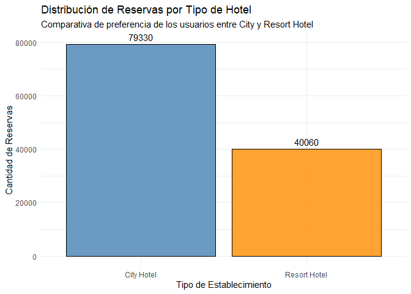<!-- -->

- Se observa una predominancia volumétrica del City Hotel. Este hallazgo
es un indicador técnico clave, ya que previene al equipo sobre la
tendencia de las variables numéricas: en un entorno urbano, los
promedios de estancias y servicios adicionales suelen ser más reducidos
y estandarizados que en un Resort.

- Se confirma que el Resort Hotel, a pesar de tener un volumen menor,
posee una base de datos lo suficientemente robusta (superando los 40,000
registros) para ser analizada de forma independiente. Esto justifica
técnicamente que todas las métricas futuras sean segmentadas por esta
variable para evitar que el peso del hotel de ciudad “contamine” los
patrones de comportamiento del hotel vacacional.

- La visualización ratifica que el marco de datos es apto para responder a
las necesidades de infraestructura y logística, permitiendo que la
variable actúe como el filtro primario para la limpieza y exploración
que se desarrollará en las siguientes fases.

**Análisis de la variable: is_canceled (Estado de la cancelación)**

La variable is_canceled constituye el indicado crítico de efectividad comercial en este estudio. Al ser una métrica de solo dos valores (1 y 0), su análisis visual mediante un gráfico de barras proporcionales permite identificar el índice de mortalidad de las reservas, factor determinante para la estabilidad financiera de los hoteles.

El uso de un gráfico de barras apiladas es fundamental porque permite
normalizar los datos entre el City Hotel y el Resort Hotel. Dado que el
volumen de reservas es distinto para cada establecimiento, una
comparativa de frecuencias absolutas sería engañosa. Este gráfico de
proporciones revela la tasa real de cancelación, permitiendo comparar la
eficiencia operativa de ambos modelos de negocio de manera equitativa.
Para realizar este gráfico realizamos el siguiente código en R:

``` r
ggplot(df, aes(x = hotel, fill = factor(is_canceled))) +
  geom_bar(position = "fill") +
  scale_y_continuous(labels = scales::percent) +
  scale_fill_manual(values = c("0" = "forestgreen", "1" = "firebrick"),
                    labels = c("Check-out (Efectiva)", "Cancelada"),
                    name = "Estado") +
  labs(title = "Tasa de Cancelación por Tipo de Hotel",
       subtitle = "Análisis proporcional de la pérdida de reservas",
       x = "Establecimiento",
       y = "Porcentaje de Reservas") +
  theme_minimal()
```

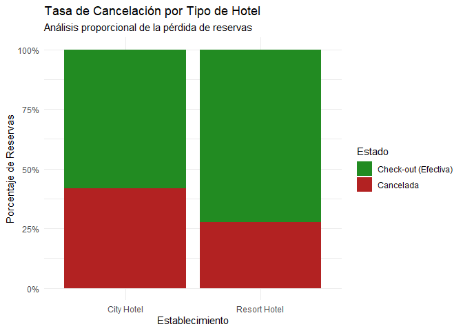<!-- -->
Al inspeccionar el gráfico de barras apiladas ofrece una perspectiva
estratégica para las empresas:

- Identificar riesgo operativo: Permite visualizar si el City Hotel, a
pesar de tener más demanda, sufre de una tasa de cancelación más alta en
comparación al Resort, lo que sugeriría la necesidad de políticas de
depósito más estrictas.

- El gráfico evidencia que el volumen de cancelaciones es lo
suficientemente representativo como para no ser considerado un error
marginal. Esto valida la decisión del equipo de utilizar esta columna
como el filtro maestro para limpiar la demanda real en los cálculos de
ocupación y duración de estadías.

- La presencia de ambas categorías asegura que el marco de datos permite
realizar comparativas entre el éxito y el fracaso de las reservas,
otorgando la profundidad necesaria para una auditoría de ingresos y
logística hotelera.

**Análisis de la variable: arrival_date_year (Año
de llegada)**

La variable arrival_date_year sitúa cronológicamente los registros del
dataset en tres periodos anuales: 2015, 2016 y 2017. Para su validación,
se ha empleado un gráfico de barras que permite observar la distribución
de la carga de datos en cada uno de estos años.

El uso de esta visualización es fundamental para verificar la
continuidad y consistencia del horizonte temporal. Antes de realizar
cualquier análisis de tendencias, el equipo debe asegurar que no existan
vacíos de información o años con una presencia nula de datos. Este
gráfico funciona como una auditoría técnica para garantizar que la base
de datos es robusta y apta para comparativas temporales.

Código para realizar este gráfico:

``` r
ggplot(df, aes(x = factor(arrival_date_year), fill = factor(arrival_date_year))) +
  geom_bar(color = "black", alpha = 0.7) +
  geom_text(stat = 'count', aes(label = after_stat(count)), vjust = -0.5, size = 3.5) +
  scale_fill_brewer(palette = "Greens") +
  labs(title = "Distribución Temporal de los Registros",
       subtitle = "Auditoría de consistencia del horizonte temporal (2015-2017)",
       x = "Año de Llegada",
       y = "Cantidad de Registros") +
  theme_minimal() +
  theme(legend.position = "none")
```

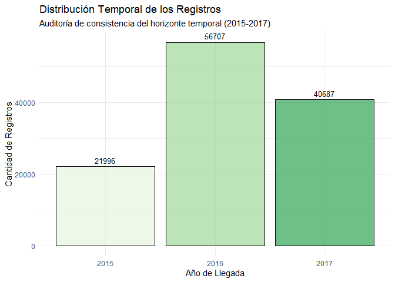

- Se confirma que el dataset cuenta con registros para los tres años
consecutivos mencionados, lo que asegura que existe una secuencia
temporal lógica para el estudio.

- El gráfico permite identificar si la cantidad de registros es
equilibrada o si existen años con una representación significativamente
menor. Esta observación es vital para que, en etapas posteriores, los
cálculos no se vean sesgados por una disparidad extrema en el volumen de
información entre un año y otro.

- Al visualizar que todos los años están representados, se valida que el
marco de datos permite observar la evolución del comportamiento hotelero
a largo plazo, otorgando validez técnica a las agrupaciones anuales que
se realicen en el análisis de resultados.

**Análisis de la variable: arrival_date_month (Mes de llegada)**

La variable arrival_date_month organiza la afluencia de registros en un
ciclo anual de doce meses. Para su validación técnica, se ha generado un
gráfico de barras que ordena cronológicamente la frecuencia de las
reservas desde enero hasta diciembre.

El uso de esta visualización es imperativo para certificar la cobertura
estacional del dataset. En el sector hospitalario, el análisis de
tendencias depende de la continuidad de los datos a lo largo de las
estaciones del año. Este gráfico actúa como una auditoría de
completitud, permitiendo al equipo asegurar que no existan meses con
ausencia de registros que pudieran sesgar la interpretación de los
ciclos de demanda o invalidar la representatividad de la muestra.

El siguiente gráfico es realizado con este código de R:

``` r
ggplot(df, aes(x = arrival_date_month, fill = arrival_date_month)) +
  geom_bar(color = "black", alpha = 0.7) +
  theme_minimal() +
  theme(axis.text.x = element_text(angle = 45, hjust = 1),
        legend.position = "none") +
  labs(title = "Distribución Mensual de Registros",
       subtitle = "Auditoría de cobertura estacional y completitud del ciclo anual",
       x = "Mes de Llegada",
       y = "Cantidad de Reservas") +
  scale_fill_viridis_d(option = "mako")
```

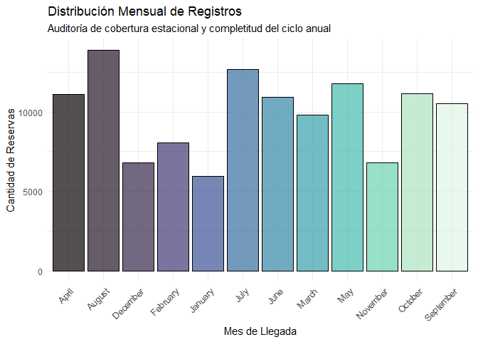

- Se verifica que el dataset contiene registros para todos los meses del
año, garantizando que el marco de datos es apto para un análisis de
estacionalidad sin vacíos de información.

- El gráfico permite observar la distribución de la carga operativa mes a
mes. Esto valida técnicamente la capacidad del dataset para ser
segmentado posteriormente en periodos de temporada, asegurando que la
variabilidad observada responde a la naturaleza del negocio y no a una
captura de datos defectuosa.

- Al confirmar una presencia robusta de datos en cada mes, se establece la
base técnica necesaria para realizar cruces con la variable is_canceled
en fases posteriores, garantizando que las tasas de anulación mensual se
calculen sobre una muestra consistente.

##### 3.3.3.3. Reducción de Dimensionalidad (Variables numericas eliminadas)

Para este grupo se ha considerado la necesidad de establecer únicamente
8 columnas primordiales que contengan valores numéricos. Esta elección
se respalda en la relevancia de cada variable para el análisis de los
datos. Para ello se ha optado por eliminar las columnas que pueden ser
agrupadas.

**Variables de Historial y Fidelización del Cliente.**

En este grupo
se encuentran las variables previous_cancellations y
previous_bookings_not_canceled. Estas métricas describen el
comportamiento histórico del huésped en estancias anteriores.

``` r
df %>%
  select(previous_cancellations, previous_bookings_not_canceled) %>%
  pivot_longer(cols = everything(),
               names_to = "Variable",
               values_to = "Cantidad") %>%
  
  ggplot(aes(x = Variable, y = Cantidad, color = Variable)) +
  
  geom_jitter(width = 0.25, height = 0, alpha = 0.3, size = 1.5) +
  
  scale_color_manual(values = c(
    "previous_cancellations" = "#BD1100",
    "previous_bookings_not_canceled" = "steelblue"
  )) +
  
  theme_minimal() +
  theme(legend.position = "none") +
  
  labs(
    title = "Dispersión del Historial del Huésped",
    x = "Variable",
    y = "Cantidad"
  )+
  theme(plot.title = element_text(face = "bold", hjust = 0.5))
```

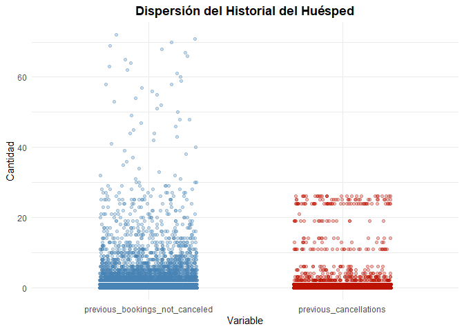

El gráfico demuestra de forma directa una concentración extrema en el valor cero para ambas variables. La densidad de puntos superpuestos en
la base confirma que la mayoría de los usuarios carece de historial
previo en el hotel. Los puntos dispersos a lo largo del eje vertical
representan fracciones mínimas del conjunto de datos y actúan como casos
aislados. 

Sin embargo, en nuestro análisis el interés reside en la
exploración de las reservas actuales. Incluir estas variables podría
generar un sesgo concerniente a los clientes recurrentes, lo cual podría
difuminar los patrones de comportamiento de la demanda general que se
busca identificar en este análisis.

**Variables de Gestión Operativa y Administrativa**

En este grupo se encuentran las variables days_in_waiting_list y
booking_changes, dado que representan eventos que ocurren después de que
la intención de reserva haya sido manifestada. booking_changes mide la
eficiencia administrativa y days_in_waiting_list mide la capacidad de
respuesta del hotel ante la sobreventa.

Luego de haber definido estas variables podemos realizar un análisis
favoreciendo a la industria hotelera con lo siguiente: Para evaluar si
la demora en la confirmación impacta en la estabilidad de la reserva, se
ha desarrollado un Heatmap de Densidad Proporcional. Dado que la mayoría
de los registros se concentran en valores bajos, se han agrupado los
días de espera en rangos lógicos para identificar “zonas de fricción”
administrativa.

Por ello realizamos el siguiente código en R para poder analizar estas
variables con relación al dataset, para realizarlo creamos una copia del
dataset original con dos nuevas variables de rango porcentual para las
variables de days_in_waiting_list y booking_changes:

- Dos nuevas variables temporales creadas para este análisis:

  - espera_rango: Agrupa la variable original days_in_waiting_list, que
registra los días transcurridos desde que la reserva ingresó al sistema
hasta que fue confirmada al cliente. Su objetivo es categorizar el
tiempo de espera en periodos lógicos (como “1-15 días” o “Más de 60
días”) para identificar el umbral de paciencia del huésped antes de que
su comportamiento se vuelva inestable.

  - cambios_rango: Clasifica la variable booking_changes, que contabiliza
todas las modificaciones o enmiendas (como cambios en el número de
personas, fechas o tipo de habitación) realizadas desde la creación de
la reserva hasta el check-in o cancelación. Esta agrupación permite
distinguir claramente entre reservas estables (0 cambios) y aquellas que
representan una alta carga administrativa para el hotel (3 o más
cambios).

``` r
# Copia del dataset con rangos porcentuales
df_heatmap <- df %>%
  mutate(
    espera_rango = case_when(
      days_in_waiting_list == 0 ~ "0 días",
      days_in_waiting_list <= 15 ~ "1-15 días",
      days_in_waiting_list <= 30 ~ "16-30 días",
      days_in_waiting_list <= 60 ~ "31-60 días",
      TRUE ~ "Más de 60 días"
    ),
    cambios_rango = case_when(
      booking_changes == 0 ~ "0",
      booking_changes == 1 ~ "1",
      booking_changes == 2 ~ "2",
      TRUE ~ "3 o más"
    )
  ) %>%
  count(espera_rango, cambios_rango) %>%
  group_by(espera_rango) %>%
  mutate(porcentaje = n / sum(n) * 100)

df_heatmap$espera_rango <- factor(df_heatmap$espera_rango, 
                                  levels = c("0 días", "1-15 días", "16-30 días", "31-60 días", "Más de 60 días"))

ggplot(df_heatmap, aes(x = cambios_rango, y = espera_rango, fill = porcentaje)) +
  geom_tile(color = "white") +
  scale_fill_gradient(low = "#f7fbff", high = "#084594") +
  geom_text(aes(label = sprintf("%.1f%%", porcentaje)), size = 3,
            color = ifelse(df_heatmap$porcentaje > 50, "white", "black")) +
  labs(title = "Matriz de Fricción: Espera vs. Estabilidad",
       subtitle = "Porcentaje de modificaciones según el tiempo en lista de espera",
       x = "Cantidad de Cambios en la Reserva",
       y = "Días en Lista de Espera",
       fill = "% de Casos") +
  theme_minimal()
```

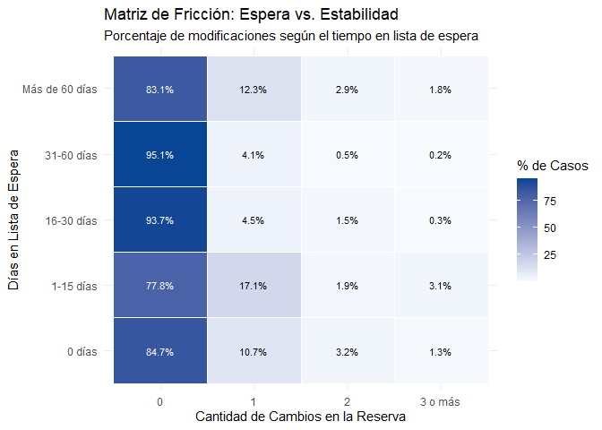

**Variables Demográficas y Requerimientos de Servicio**

En este grupo se encuentran la variable total_of_special_requests.
Históricamente, se asume que un alto número de peticiones especiales
indica un perfil de cliente más exigente o detallista. Sin embargo, tras
delimitar el alcance de este estudio hacia la composición familiar
(menores) y el tipo de cliente (customer_type), se procedió a evaluar si
los requerimientos especiales aportan valor predictivo real. Por lo
cual, su implementación dentro del estudio solo acrecentaría carga
procesal que limitaría el verdadero fin de la misma.

``` r
df %>%
  count(customer_type, total_of_special_requests) %>%
  group_by(customer_type) %>%
  mutate(porcentaje = n / sum(n) * 100) %>%
  ggplot(aes(x = customer_type, y = porcentaje, fill = as.factor(total_of_special_requests))) +
  geom_bar(stat = "identity", position = "stack") +
  scale_fill_brewer(palette = "Blues", name = "N° Pedidos") +
  theme_minimal() +
  labs(
    title = "Distribución de Requerimientos Especiales por Segmento",
    subtitle = "Análisis de la carga de servicios adicionales por tipo de cliente",
    x = "Segmento de Cliente",
    y = "Porcentaje de Reservas (%)"
  ) +
  theme(plot.title = element_text(face = "bold", hjust = 0.5))
```

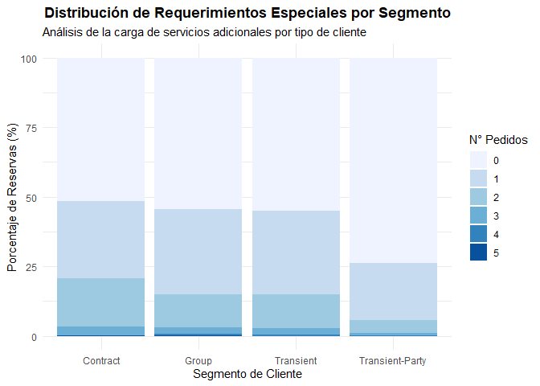<!-- -->
El análisis revela que en todos los segmentos de cliente, más del 80% de
las reservas registran cero o un solo pedido especial. Esto no demuestra
que la variable posee una baja variable y se comporta de manera casi
constante en la gran mayoría del dataset.

Desde una perspectiva operativa, los pedidos especiales pertenecen a la
gestión de satisfacción post reserva y personalización del servicio, lo
cual excede los objetivos macro de este análisis enfocados en la demanda
física. Por lo cual, su implementación solo acrecentaría la carga
procesal del modelo sin aportar capacidad explicativa relevante,
determinando así su exclusión.

##### 3.3.3.4 Reducción de Dimensionalidad (Variables numericas que se conservan)

Para este grupo se han seleccionado las siguientes 8 variables numéricas
por su impacto dentro del análisis estadístico y resolución de preguntas
del negocio.

**Variables de estancia y temporalidad**

En este grupo se encuentran
las variables lead_time, stays_in_weekend_nights y stays_in_week_nights.
Ya que estas métricas describen cuánto tiempo antes se planifica la
reserva y la duración real de la estancia dividida por tipo de día.
Estas variables son fundamentales para determinar el comportamiento de
la demanda y entender si el flujo de huéspedes es mayormente vacacional
o de negocios.

``` r
# --- BLOQUE 1: Tiempos y Estancias ---
f1 <- ggplot(df, aes(x="", y = lead_time)) + geom_boxplot(fill = "gray",outlier.colour = "red") + 
  labs(title = "Anticipación", y="Días") + theme_minimal() + theme(plot.title = element_text(hjust = 0.5, face = "bold"))

f2 <- ggplot(df, aes(x="",y = stays_in_weekend_nights)) + geom_boxplot(fill = "gray", outlier.colour = "red") + 
  labs(title = "Noches Finde", y="Noches") + theme_minimal() + theme(plot.title = element_text(hjust = 0.5, face = "bold"))

f3 <- ggplot(df, aes(x="",y = stays_in_week_nights)) + geom_boxplot(fill = "gray", outlier.colour = "red") + 
  labs(title = "Noches Semana", y="Noches") + theme_minimal() + theme(plot.title = element_text(hjust = 0.5, face = "bold"))

f1 + f2 + f3 # Imprime el primer bloque
```

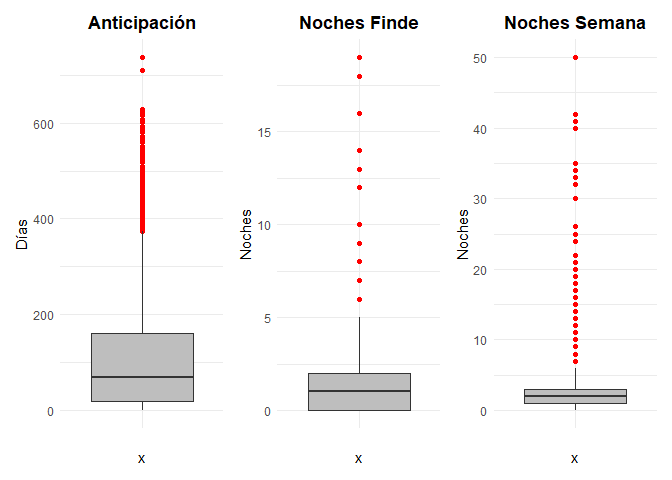<!-- -->

La inspección visual a través de los boxplots revela una alta presencia
de valores atípicos (outliers) en el tiempo de anticipación, con
registros que superan los 400 días. Esto demuestra que el hotel enfrenta
una demanda con horizontes de planificación muy diversos. En cuanto a
las estancias, se observa una estructura de datos limpia que permite
calcular la duración total del viaje, dato esencial para los objetivos
de este proyecto.

**Variables de composicion del grupo familiar**

Aquí se incluyen adults, children y babies. Estas variables cuantifican
la cantidad y el tipo de personas que integran la reserva. Su análisis
es vital para identificar el perfil del cliente preferencial y cómo esto
influye en la elección del tipo de hotel

``` r
# --- BLOQUE 2: Composición familiar ---
f4 <- ggplot(df, aes(x="",y = adults)) + geom_boxplot(fill = "gray", outlier.colour = "red") + 
  labs(title = "Adultos", y="Cantidad") + theme_minimal() + theme(plot.title = element_text(hjust = 0.5, face = "bold"))

f5 <- ggplot(df, aes(x="",y = children)) + geom_boxplot(fill = "gray", outlier.colour = "red") + 
  labs(title = "Niños", y="Cantidad") + theme_minimal() + theme(plot.title = element_text(hjust = 0.5, face = "bold"))

f6 <- ggplot(df, aes(x="",y = babies)) + geom_boxplot(fill = "gray", outlier.colour = "red") + 
  labs(title = "Bebés", y="Cantidad") + theme_minimal() + theme(plot.title = element_text(hjust = 0.5, face = "bold"))

f4 + f5 + f6 # Imprime el segundo bloque
```

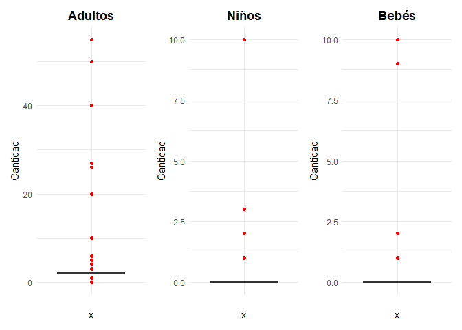<!-- -->

Aunque los gráficos de menores (children y babies) muestran una
concentración masiva en cero, su conservación es una decisión
estratégica. Estos datos permiten identificar el “perfil familiar”, un
segmento con necesidades logísticas específicas que influye directamente
en la elección entre un Resort y un City Hotel. La variable de adultos,
por su parte, confirma que el grueso de la demanda es de carácter
maduro.

**Variables de rentabilidad y logística**

``` r
f7 <- ggplot(df, aes(x="",y = required_car_parking_spaces)) + geom_boxplot(fill = "gray", outlier.colour = "red") + 
  labs(title = "Parqueos") + theme_minimal() + theme(plot.title = element_text(hjust = 0.5, face = "bold"))


f8 <- ggplot(df, aes(x="",y = adr)) + geom_boxplot(fill = "orange", outlier.colour = "red") + 
  labs(title = "Tarifa Diaria (ADR)") + theme_minimal() + theme(plot.title = element_text(hjust = 0.5, face = "bold"))

f7 + f8 
```

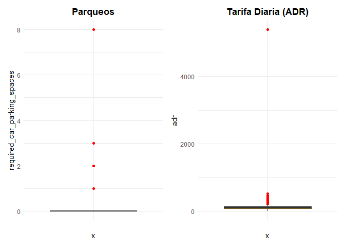<!-- -->
El análisis visual del adr expone una variabilidad extrema que responde
a la estacionalidad del mercado. La detección de un outlier cercano a
los 5,400 unidades monetarias es un hallazgo técnico clave, ya que
obliga al equipo a tratar estos valores antes de generar promedios de
ingresos. Por otro lado, la variable de
estacionamiento(required_car_parking_spaces) funciona como un
diferenciador de infraestructura que complementa el estudio físico de la
demanda.

#### 3.3.4 Detección y tratamiento de Outliers

Una vez garantizada la integridad de los registros mediante la auditoría
de duplicados y la selección de las variables de interés, el siguiente
paso crítico en el preprocesamiento es la identificación de outliers.
Este análisis se aplica de manera exclusiva a las 7 variables numéricas
conservadas, con el fin de detectar ruidos estadísticos o errores de
captura que podrían sesgar los resultados de las preguntas de negocio.

El objetivo central de esta detección es purificar el conjunto de datos
para que los resultados reflejen patrones de comportamiento reales y no
anomalías que distorsionen las tendencias. Identificar y tratar estos
valores es fundamental para responder las preguntas planteadas,
garantizar la precisión en la toma de decisiones y validar la capacidad
operativa de los hoteles identificados.

**Tratamiento visual para las variables de baja variabilidad**

Si bien el diagrama de caja es la herramienta estándar para la detección de
valores atípicos, en variables como children, babies y
required_car_parking_spaces este método no logra reflejar de forma clara
la distribución de los datos. Esto se debe a que la gran mayoría de los
registros se concentran en el valor cero, lo que provoca que los
cuartiles coincidan en una sola línea base y se dificulte la observación
de la frecuencia real de los valores que sobresalen.

#### **Tratamiento y detección de outliers en la variable children**
Después de hacer la detección de outliers para la variable children se
encontraron valores atípicos, en este caso particular una reserva que
contempla 10 niños. El gráfico de barras puede usarse para representar
de mejor manera este valor, como puede verse a continuación, donde el
valor 10 representa una ínfima parte de la totalidad. Luego en la
representación del gráfico de cajas podemos ver que tanto se aleja este
valor de los más comunes. Por tal, se determina que la inclusión de este
único valor en el análisis final puede conllevar a un error de cálculo,
dado que es una muestra despreciable.

Este gráfico muestra muy bien cuál es el valor atípico, sin embargo, es
necesario descubrir cuáles son las filas que contienen estos valores.
Para ello será necesario ejecutar un código que devuelva las filas que
contienen este valor.

``` r
g_children <- ggplot(df, aes(x = as.factor(children))) +
  geom_bar(fill = "darkorange", color = "black") +
  labs(title = "Distribución de Niños por Reserva",
       subtitle = "Detección de valores atípicos",
       x = "Cantidad de Niños",
       y = "Número de Reservas") +
  theme_minimal()

f5 <- ggplot(df, aes(x="",y = children)) + geom_boxplot(fill = "gray", outlier.colour = "red") + 
  labs(title = "Niños", y="Cantidad") + theme_minimal() + theme(plot.title = element_text(hjust = 0.5, face = "bold"))

g_children + f5
```

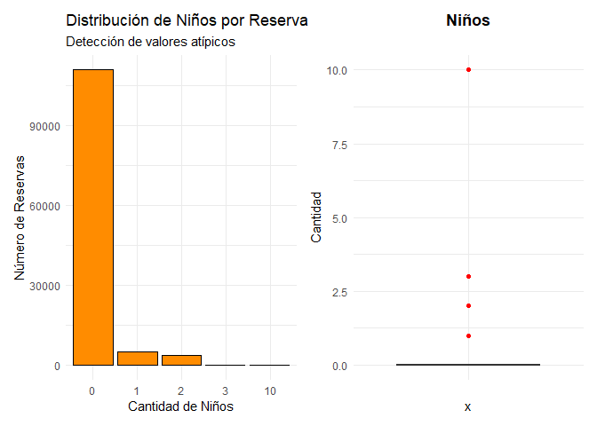<!-- -->

Este gráfico muestra muy bien cuál es el valor atípico, sin embargo, es
necesario descubrir cuáles son las filas que contienen estos valores.
Para ello será necesario ejecutar un código que devuelva las filas que
contienen este valor.

``` r
df %>% 
  mutate(fila = row_number()) %>%
  identify_outliers(children) %>%
  filter(children == 10)
```

    ##          hotel is_canceled lead_time arrival_date_year arrival_date_month
    ## 1 Resort Hotel           1        55              2015               July
    ##   arrival_date_week_number arrival_date_day_of_month stays_in_weekend_nights
    ## 1                       29                        12                       4
    ##   stays_in_week_nights adults children babies meal country market_segment
    ## 1                   10      2       10      0   BB     PRT  Offline TA/TO
    ##   distribution_channel is_repeated_guest previous_cancellations
    ## 1                TA/TO                 0                      0
    ##   previous_bookings_not_canceled reserved_room_type assigned_room_type
    ## 1                              0                  D                  D
    ##   booking_changes deposit_type agent company days_in_waiting_list customer_type
    ## 1               2   No Deposit     8       0                    0      Contract
    ##      adr required_car_parking_spaces total_of_special_requests
    ## 1 133.16                           0                         1
    ##   reservation_status reservation_status_date fila is.outlier is.extreme
    ## 1            No-Show              2015-07-12  329       TRUE       TRUE

La detección de filas con estos valores atípicos confirman que existe
solo en la fila 329, lo cual ayuda a comprender qué es realmente un caso
aislado. Dado que este valor es realmente escaso se ha de proceder a
representar los datos de forma que se pueda entender y analizar de
manera más eficiente y precisa con los datos que se dispone. Para ello
se ha optado por la creación de una nueva variable que represente la
proporción entre reservas que contemplan niños y las que no las
incluyen. Luego se procederá a graficar estos valores encontrados para
la muestra adecuada y más precisa de las frecuencias en cada caso.

``` r
#cramos un nuevo df2 para guardar cambios 
df2 <- df

# 1. Creación de la variable categórica para niños
df2 <- df2 %>%
mutate(perfil_nino = if_else(children > 0, "Con Niños", "Sin Niños"))
# 2. Convertir a factor para el análisis
df2$perfil_nino <- as.factor(df2$perfil_nino)
# 3. Ver el conteo (notarás que 'Sin Niños' es la gran mayoría)
table(df2$perfil_nino)
```

    ## 
    ## Con Niños Sin Niños 
    ##      8590    110800

``` r
ggplot(df2, aes(x = perfil_nino, fill = perfil_nino)) +
  geom_bar() +
  labs(title = "Distribución de Reservas: Presencia de Niños",
       subtitle = "Análisis de segmentación",
       x = "Segmento de Reserva",
       y = "Cantidad de Registros") +
  scale_fill_manual(values = c("Con Niños" = "#33a02c", "Sin Niños" = "#1f78b4")) +
  theme_minimal() +
  theme(legend.position = "none")
```

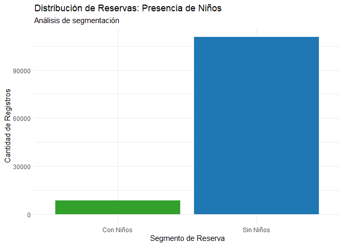<!-- -->
Este último gráfico representa de mejor manera la proporción entre
reservas que contemplan niños de las que no. A partir de ella se puede
visualizar la gran diferencia entre la frecuencia de cada grupo, donde
casi la totalidad de los valores lo contiene la frecuencia de las
reservas sin niños. Estos valores serán relevantes para próximas
campañas u oferta de nuevos servicios enfocadas principalmente en el
mayor grupo de segmento que se hospeda en el hotel.

##### **Tratamiento y detección de outliers para la variable babies**

Para el caso de la variable babies se identificaron registros con
valores de 9 y 10 bebés en una sola reserva, los cuales representan
valores valores atípicos además de representar solo una pequeña parte de
la totalidad. Como puede verse en el gráfico de barras el valor más
predominante es 0, incluso cifras como 1 o 2 representan solo una
porción muy escasa. Luego al comparar con el gráfico de cajas se observa
y determina que los valores de 9 y 10 se alejan demasiado de los valores
típicos. Por tanto, en base a la cantidad de elementos se puede decir
que tanto las reservas con 9 y 10, que solo representan 1
respectivamente, son despreciables en nuestro análisis.

``` r
g_babies <- ggplot(df, aes(x = as.factor(babies))) +
  geom_bar(fill = "steelblue", color = "black") +
  labs(title = "Distribución de Bebés por Reserva",
       subtitle = "Detección de valores atípicos (frecuencias inusuales)",
       x = "Cantidad de Bebés",
       y = "Número de Reservas") +
  theme_minimal()


f6 <- ggplot(df, aes(x="",y = babies)) + geom_boxplot(fill = "gray", outlier.colour = "red") + 
  labs(title = "Bebés", y="Cantidad") + theme_minimal() + theme(plot.title = element_text(hjust = 0.5, face = "bold"))

g_babies + f6
```

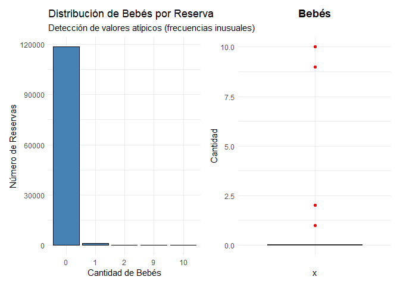<!-- -->
Después de esto se analiza cuál es la fila o filas que contienen este
valor atípico, de forma que ayude a definir que hacer exactamente con
estos datos. Para ello se ha utilizado el siguiente código:

``` r
df %>% 
  mutate(fila = row_number()) %>%
  identify_outliers(babies) %>%
  select(fila, babies, is.outlier, is.extreme) %>% 
  filter(babies == 10) 
```

    ##    fila babies is.outlier is.extreme
    ## 1 46620     10       TRUE       TRUE

Al ejecutar el código se puede corroborar que es únicamente la fila
46620 la que contiene este valor atípico. Esto conlleva a plantear
formas de agrupar los datos para poder representar mejor los valores
para obtener un mejor panorama y resultados más consistentes. En este
caso se ha optado por la creación de una variable que permita observar
los grupos de servicios que contemplan la variables babies y los que no.
Luego de convertir la variable a un nuevo factor haremos la gráfica para
representar la diferencia entre la frecuencia de las reservas con bebés
y las que no tienen.

``` r
# Creamos la variable 'perfil_babies' 
df2<- df2 %>% 
mutate(perfil_babies = if_else(babies > 0, "Con Bebés", "Sin Bebés")) 
# Convertimos a factor para asegurar el orden en el gráfico 
df2$perfil_babies <- as.factor(df2$perfil_babies)
#Verificamos el conteo de los valores
table(df2$perfil_babies)
```

    ## 
    ## Con Bebés Sin Bebés 
    ##       917    118473

``` r
#falta grafico
```

Este gráfico representa de mejor manera la proporción y la diferencia
entre la frecuencia de ambos escenarios. Como pudo verse la diferencia
es notoria, donde casi la totalidad de las reservas no tienen registrado
la presencia de bebés en las estadías de los huéspedes. Este valor es de
vital importancia, dado que permite plantear servicios especializados
para el mayor grupo de potenciales clientes. Lo cual puede mejorar la
experiencia y mantener la fidelización. Por otro lado puede verse la
similitud que comparte con el análisis de la variable children.

##### **Tratamiento y detección de outliers para la variable required_car_parking_space**

Para variable required_car_parking_spaces, el diagrama de caja resulta
insuficiente debido a que la gran mayoría de las reservas no solicitan
estacionamiento, lo que concentra los datos en el valor cero y oculta la
frecuencia de los pedidos reales. Por esta razón, se implementó un
gráfico de barras con escala logarítmica, el cual permite visualizar de
manera clara que, aunque existen solicitudes legítimas de 1 o 2 o 3,
valores como el 8 aparecen como frecuencias aisladas y
desproporcionadas. Esta técnica facilita la visualización del ruido
estadístico introducido en el dataset, permitiendo diferenciar entre una
necesidad de infraestructura real y un error de captura o dato atípico
extremo.

``` r
# Gráfico para detectar anomalías en requerimiento de estacionamientos
g_parking <- ggplot(df, aes(x = as.factor(required_car_parking_spaces))) +
  geom_bar(fill = "olivedrab", color = "black") +
  scale_y_log10() + # Para que los valores pequeños (outliers) sean visibles
  labs(title = "Detección de Outliers en Estacionamientos",
       subtitle = "Uso de escala logarítmica para identificar pedidos inusuales",
       x = "Espacios de Estacionamiento Requeridos",
       y = "Conteo (Log10)") +
  theme_minimal()

f7 <- ggplot(df, aes(x="",y = required_car_parking_spaces)) + geom_boxplot(fill = "gray", outlier.colour = "red") + 
  labs(title = "Parqueos") + theme_minimal() + theme(plot.title = element_text(hjust = 0.5, face = "bold"))

g_parking + f7
```

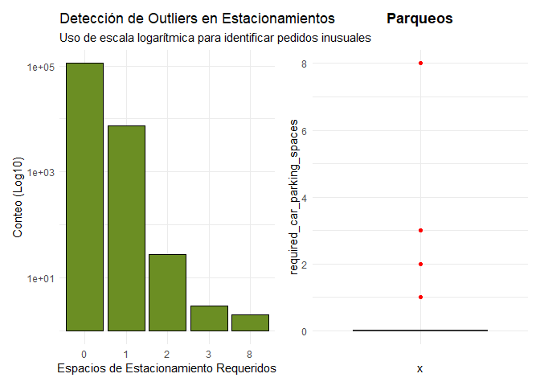

El gráfico muestra que la mayor cantidad de reservas en el hotel la
componen aquellas que no solicitan un estacionamiento. En este caso el
valor atípico está representado por el valor 8, el cual se encuentra
aislado de los valores más comunes. Sin embargo no se define con
exactitud la frecuencia que representa, para eso se hará la
identificación de las filas que contengan este valor para entender su
relevancia en este estudio.

``` r
df %>% 
  mutate(fila = row_number()) %>%
  identify_outliers(required_car_parking_spaces) %>%
  select(fila, required_car_parking_spaces, is.outlier, is.extreme) %>% 
  filter(required_car_parking_spaces == 8)
```

    ##    fila required_car_parking_spaces is.outlier is.extreme
    ## 1 29046                           8       TRUE       TRUE
    ## 2 29047                           8       TRUE       TRUE

El código ejecutado muestra a detalle qué exactamente son dos filas que
contienen este valor, esto representa una cantidad despreciable en el
presente estudio. Para realmente obtener un valor de los valores
analizados se optará por crear una nueva variable que contenga la
necesidad o la falta de reservas con estacionamiento.

``` r
df2 <- df2 %>%
mutate(perfil_estacionamiento = if_else(required_car_parking_spaces > 0, "Con Estacionamiento",  "Sin Estacionamiento"))

# Convertir a factor
df2$perfil_estacionamiento <- as.factor(df2$perfil_estacionamiento)


table(df2$perfil_estacionamiento)
```

    ## 
    ## Con Estacionamiento Sin Estacionamiento 
    ##                7416              111974

``` r
# Gráfico comparativo: Con Estacionamiento vs Sin Estacionamiento
ggplot(df2, aes(x = perfil_estacionamiento, fill = perfil_estacionamiento)) +
  geom_bar() +
  # Aplicamos escala logarítmica para que el segmento "Con Estacionamiento" sea visible
  labs(title = "Distribución de Reservas: Requerimiento de Estacionamiento",
       subtitle = "Comparación de volumen entre categorías",
       x = "Segmento de Estacionamiento",
       y = "Cantidad de Registros") +
  scale_fill_manual(values = c("Con Estacionamiento" = "#4daf4a", "Sin Estacionamiento" = "#984ea3")) +
  theme_minimal() +
  theme(legend.position = "none")
```

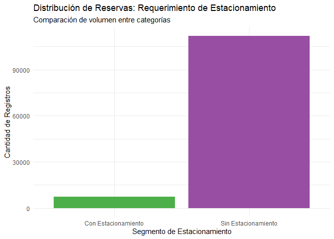<!-- -->
El gráfico muestra la proporción entre la diferencia de frecuencias
entre las reservas que requieren estacionamientos frente a las que no la
necesitan. De forma que 7416 es el total de reversas que contemplan la
necesidad de separar estacionamiento. Esto supone como ya se había visto
anteriormente, una cifra pequeña en relación al total de los que no
solicitaron estacionamiento.

\#####-**Tratamiento y detección de outliers en la variable adults**

Para la variable adults la gráfica de cajas resulta incompleta para
mostrar los valores tanto como para identificar la frecuencia como
definir su relevancia en el estudio. Por esta razón se vuelve a utilizar
el gráfico de barras como complemento para el estudio y análisis de
valores atípicos. Esté gráfico permitirá detectar los valores anormales
y descubrir su frecuencia para definir su relevancia en el análisis de
los datos.

``` r
f4 <- ggplot(df, aes(x="",y = adults)) + geom_boxplot(fill = "gray", outlier.colour = "red") + 
  labs(title = "Adultos", y="Cantidad") + theme_minimal() + theme(plot.title = element_text(hjust = 0.5, face = "bold"))
f4
```

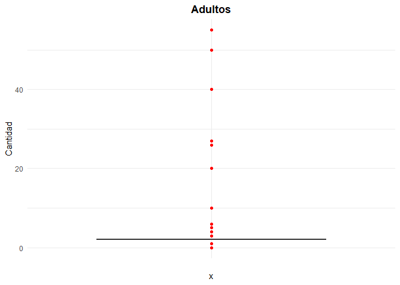<!-- -->

El gráfico muestra con mayor detalle la diferencia de proporciones entre
los valores existentes en esta variable, esto permite definir qué
valores están fuera de lo común y cuál es su frecuencia. De esto podemos
concluir que los valores después de 20 pueden considerarse como outliers
y que la mayor frecuencia se encuentra en 2 adultos por reserva. Después
de detectar estos valores se debe encontrar la cantidad exacta y las
filas que las contienen. Para esto, se buscará en cada fila cuyo valor
en la variable adults sea mayor o igual a 20. Sin embargo, al observar
el gráfico también se ve un valor peculiar y muy extraño, el valor 0, el
cual también deberá ser analizado.

``` r
df %>% 
  mutate(fila = row_number()) %>%
  identify_outliers(adults) %>%
  select(fila, adults, is.outlier, is.extreme) %>% 
  filter(adults >= 20 )
```

    ##    fila adults is.outlier is.extreme
    ## 1  1540     40       TRUE       TRUE
    ## 2  1588     26       TRUE       TRUE
    ## 3  1644     50       TRUE       TRUE
    ## 4  1753     26       TRUE       TRUE
    ## 5  1885     26       TRUE       TRUE
    ## 6  1918     27       TRUE       TRUE
    ## 7  1963     27       TRUE       TRUE
    ## 8  2004     26       TRUE       TRUE
    ## 9  2165     26       TRUE       TRUE
    ## 10 2174     55       TRUE       TRUE
    ## 11 2229     20       TRUE       TRUE
    ## 12 2419     20       TRUE       TRUE

La tabla anterior muestra la cantidad de valores que están fuera de lo
normal son escasos frente a la totalidad de la variable. Sin embargo,
debe considerarse que los valores son variados y representan un
escenario poco probable pero no imposible. Por otro lado la existencia
de un valor más inusual como supone el valor 0, requiere de mayor
escrutinio para para identificar la totalidad de la incongruencia en
cada fila.

``` r
df %>% 
  mutate(fila = row_number()) %>%
  identify_outliers(adults) %>%
  select(fila, adults, is.outlier, is.extreme) %>% 
  filter(adults == 0 ) %>% 
  head()
```

    ##   fila adults is.outlier is.extreme
    ## 1 2225      0       TRUE       TRUE
    ## 2 2410      0       TRUE       TRUE
    ## 3 3182      0       TRUE       TRUE
    ## 4 3685      0       TRUE       TRUE
    ## 5 3709      0       TRUE       TRUE
    ## 6 4128      0       TRUE       TRUE

Para este caso en particular, existen 403 filas que tienen como valor 0
la variable adults. Esto supone un problema al considerar que en algunas
filas se mezclan con la falta de otros valores como las variables
children o babies. Para esto se ha optado por eliminar aquellas filas
que contienen datos faltantes en 3 o más variables.

``` r
reservas_vacias <- df %>% 
  filter(adults == 0 & children == 0 & babies == 0)
reservas_vacias %>% 
  head()
```

    ##          hotel is_canceled lead_time arrival_date_year arrival_date_month
    ## 1 Resort Hotel           0         1              2015            October
    ## 2 Resort Hotel           0         0              2015            October
    ## 3 Resort Hotel           0        36              2015           November
    ## 4 Resort Hotel           0       165              2015           December
    ## 5 Resort Hotel           0       165              2015           December
    ## 6 Resort Hotel           1         0              2016           February
    ##   arrival_date_week_number arrival_date_day_of_month stays_in_weekend_nights
    ## 1                       41                         6                       0
    ## 2                       42                        12                       0
    ## 3                       47                        20                       1
    ## 4                       53                        30                       1
    ## 5                       53                        30                       2
    ## 6                        8                        15                       0
    ##   stays_in_week_nights adults children babies meal country market_segment
    ## 1                    3      0        0      0   SC     PRT      Corporate
    ## 2                    0      0        0      0   SC     PRT      Corporate
    ## 3                    2      0        0      0   SC     ESP         Groups
    ## 4                    4      0        0      0   SC     PRT         Groups
    ## 5                    4      0        0      0   SC     PRT         Groups
    ## 6                    0      0        0      0   SC Unknown  Offline TA/TO
    ##   distribution_channel is_repeated_guest previous_cancellations
    ## 1            Corporate                 0                      0
    ## 2            Corporate                 0                      0
    ## 3                TA/TO                 0                      0
    ## 4                TA/TO                 0                      0
    ## 5                TA/TO                 0                      0
    ## 6                TA/TO                 0                      0
    ##   previous_bookings_not_canceled reserved_room_type assigned_room_type
    ## 1                              0                  A                  I
    ## 2                              0                  A                  I
    ## 3                              0                  A                  C
    ## 4                              0                  A                  A
    ## 5                              0                  A                  C
    ## 6                              0                  P                  P
    ##   booking_changes deposit_type agent company days_in_waiting_list
    ## 1               1   No Deposit     0     174                    0
    ## 2               0   No Deposit     0     174                    0
    ## 3               0   No Deposit    38       0                    0
    ## 4               1   No Deposit   308       0                  122
    ## 5               1   No Deposit   308       0                  122
    ## 6               0   No Deposit     0     383                    0
    ##     customer_type adr required_car_parking_spaces total_of_special_requests
    ## 1 Transient-Party   0                           0                         0
    ## 2       Transient   0                           0                         0
    ## 3 Transient-Party   0                           0                         0
    ## 4 Transient-Party   0                           0                         0
    ## 5 Transient-Party   0                           0                         0
    ## 6       Transient   0                           0                         0
    ##   reservation_status reservation_status_date
    ## 1          Check-Out              2015-10-06
    ## 2          Check-Out              2015-10-12
    ## 3          Check-Out              2015-11-23
    ## 4          Check-Out              2016-01-04
    ## 5          Check-Out              2016-01-05
    ## 6           Canceled              2016-02-15

Esta tabla resulta muy importante, con ella descubrimos que realmente
existen 180 filas que tienen como valor 0 las variables adults, children
y babies. Desde la perspectiva de negocio, una reserva sin huéspedes
representa una transacción nula o un error del sistema de registro . Al
no contener información sobre la demanda real, estos registros se
clasifican como ruido y deben ser eliminados para no distorsionar los
valores finales del análisis. Después de la eliminación se procederá a
modificar los valores restantes, los 223 filas en total a través del uso
de la mediana, esto será explicado después con mayor detalle.

``` r
#Eliminación de filas donde children,babies y adults son 0
df2<- df2 %>% 
  filter(!(adults == 0 & children == 0 & babies == 0))
```

Se utiliza la librería tinyverse para hacer el filtrado de acuerdo a la
cantidad de las variables adults, children y babies. Luego de ello se
corrobora si las filas ya no existen en el dataset.

``` r
reservas_vacias <- df2 %>% 
  filter(adults == 0)
reservas_vacias %>% 
  head()
```

    ##        hotel is_canceled lead_time arrival_date_year arrival_date_month
    ## 1 City Hotel           0         1              2015             August
    ## 2 City Hotel           0       104              2015             August
    ## 3 City Hotel           0         3              2015             August
    ## 4 City Hotel           0        15              2015             August
    ## 5 City Hotel           1        48              2015            October
    ## 6 City Hotel           1         6              2015           December
    ##   arrival_date_week_number arrival_date_day_of_month stays_in_weekend_nights
    ## 1                       33                        10                       1
    ## 2                       33                        11                       0
    ## 3                       34                        16                       2
    ## 4                       35                        28                       0
    ## 5                       43                        19                       1
    ## 6                       51                        13                       1
    ##   stays_in_week_nights adults children babies meal country market_segment
    ## 1                    1      0        3      0   BB     PRT         Direct
    ## 2                    3      0        2      0   BB     FRA      Online TA
    ## 3                    0      0        2      0   BB     PRT         Direct
    ## 4                    1      0        2      0   BB     PRT  Complementary
    ## 5                    3      0        2      0   BB     PRT  Offline TA/TO
    ## 6                    0      0        3      0   BB     PRT      Online TA
    ##   distribution_channel is_repeated_guest previous_cancellations
    ## 1               Direct                 0                      0
    ## 2                TA/TO                 0                      0
    ## 3               Direct                 0                      0
    ## 4               Direct                 0                      0
    ## 5                TA/TO                 0                      0
    ## 6                TA/TO                 0                      0
    ##   previous_bookings_not_canceled reserved_room_type assigned_room_type
    ## 1                              0                  B                  B
    ## 2                              0                  B                  B
    ## 3                              0                  B                  B
    ## 4                              0                  B                  B
    ## 5                              0                  B                  B
    ## 6                              0                  B                  B
    ##   booking_changes deposit_type agent company days_in_waiting_list
    ## 1               1   No Deposit     0       0                    0
    ## 2               1   No Deposit     7       0                    0
    ## 3               1   No Deposit     0       0                    0
    ## 4               0   No Deposit     0      45                    0
    ## 5               0   No Deposit    13       0                    0
    ## 6               0   No Deposit     8       0                    0
    ##     customer_type    adr required_car_parking_spaces total_of_special_requests
    ## 1 Transient-Party   9.00                           0                         0
    ## 2 Transient-Party   6.00                           0                         2
    ## 3 Transient-Party   6.00                           0                         1
    ## 4       Transient   0.00                           0                         1
    ## 5 Transient-Party   6.00                           0                         1
    ## 6 Transient-Party 104.25                           0                         1
    ##   reservation_status reservation_status_date perfil_nino perfil_babies
    ## 1          Check-Out              2015-08-12   Con Niños     Sin Bebés
    ## 2          Check-Out              2015-08-14   Con Niños     Sin Bebés
    ## 3          Check-Out              2015-08-18   Con Niños     Sin Bebés
    ## 4          Check-Out              2015-08-29   Con Niños     Sin Bebés
    ## 5           Canceled              2015-09-02   Con Niños     Sin Bebés
    ## 6           Canceled              2015-12-10   Con Niños     Sin Bebés
    ##   perfil_estacionamiento
    ## 1    Sin Estacionamiento
    ## 2    Sin Estacionamiento
    ## 3    Sin Estacionamiento
    ## 4    Sin Estacionamiento
    ## 5    Sin Estacionamiento
    ## 6    Sin Estacionamiento

Ahora puede observarse que la cantidad de filas con valor 0 en adults se
ha reducido a 223. Para estas filas restantes se debe optar por el
reemplazo del valor usando la mediana para conseguir valores que sean
más cercanos al común.

``` r
# 1. Calculamos la mediana de adultos (excluyendo los ceros para no sesgar la mediana)

mediana_adultos <- median(df2$adults[df2$adults > 0], na.rm = TRUE)
# 2. Aplicamos el cambio sólo a quienes tienen 0 

df2 <- df2 %>%
  mutate(adults = case_when(
    adults == 0 ~ mediana_adultos,
    TRUE ~ adults # Mantener el valor original en los demás casos
  ))
```

El graficó ahora muestra valores superiores a 1, este cambió de valor a
partir del uso de la mediana supone un mejor enfoque para no alterar ni
perjudicar los valores finales. La consistencia de esta técnica se basa
en calcular la mitad en torno a la totalidad de los valores, no es
simplemente una suma, por ello se consigue que el valor que reemplaza a
0 será 2.

``` r
summary(df2$adults)
```

    ##    Min. 1st Qu.  Median    Mean 3rd Qu.    Max. 
    ##   1.000   2.000   2.000   1.863   2.000  55.000

##### **Tratamiento y detección de outliers en la variable adr**

Para iniciar el análisis de la tarifa diaria (ADR), ejecutamos un
resumen estadístico general de la variable. Este primer paso nos permite
observar de inmediato los valores mínimos y máximos, y revela a simple
vista la presencia de extremos ilógicos que requieren revisión.

``` r
# 1 Exploración general de la distribución de la variable 
summary(df2$adr) 
```

    ##    Min. 1st Qu.  Median    Mean 3rd Qu.    Max. 
    ##   -6.38   69.50   94.95  101.97  126.00 5400.00

Al detectar un precio máximo irreal de 5400.00 en el resumen anterior,
filtramos este registro específico para auditar sus variables
operativas. Observamos que corresponde a un cliente no recurrente, con
una estadía de una sola noche en una habitación estándar y sin
estacionamiento. Al comparar este perfil con el de reservas similares,
confirmamos la falta total de coherencia comercial, por lo que marcamos
el registro como un error de digitación a eliminar.

``` r
# Se detectó un registro anómalo con un precio de 5400.00
# Inspeccionamos las columnas clave para buscar una justificación comercial
df2 %>% 
  select(adr, customer_type, market_segment,stays_in_weekend_nights, stays_in_week_nights,assigned_room_type,
         reservation_status) %>% 
  filter(adr == 5400.00)
```

    ##    adr customer_type market_segment stays_in_weekend_nights
    ## 1 5400     Transient  Offline TA/TO                       0
    ##   stays_in_week_nights assigned_room_type reservation_status
    ## 1                    1                  A           Canceled

``` r
# Para confirmar el error, comparamos este caso con el precio de reservas similares
# (habitaciones tipo A en el mismo segmento) 
# Confirmación: Se evidencia una falta total de correlación entre el servicio # recibido y la tarifa cobrada de 5400.00. 
# Decisión: El registro de 5400.00 queda marcado para eliminación. 

df2 %>% select(adr, customer_type, market_segment, assigned_room_type, adults, required_car_parking_spaces) %>% filter(adr > 126) %>% arrange(desc(adr)) %>% 
  head()
```

    ##      adr   customer_type market_segment assigned_room_type adults
    ## 1 5400.0       Transient  Offline TA/TO                  A      2
    ## 2  510.0       Transient  Offline TA/TO                  G      1
    ## 3  508.0       Transient      Corporate                  C      2
    ## 4  451.5 Transient-Party         Direct                  E      2
    ## 5  450.0       Transient      Online TA                  A      2
    ## 6  437.0       Transient         Direct                  H      2
    ##   required_car_parking_spaces
    ## 1                           0
    ## 2                           0
    ## 3                           1
    ## 4                           0
    ## 5                           0
    ## 6                           0

El resumen inicial también expuso la existencia de una tarifa negativa
(-6.38). Al aislar esta fila, comprobamos que se trata de una reserva de
10 noches para dos adultos. Dado que es financieramente imposible que el
hotel pagué a un cliente por su estadía, determinamos que es un error
del sistema y procedemos a marcarlo para su eliminación.

``` r
# El summary inicial reveló la existencia de tarifas negativas (imposibilidad financiera)
df2%>% 
  select(adr, customer_type, market_segment) %>% 
  filter(adr == -6.38)
```

    ##     adr   customer_type market_segment
    ## 1 -6.38 Transient-Party         Groups

``` r
# Auditoría del registro negativo:
# - Reserva para 2 adultos.
# - Estadía total de 10 noches (6 en semana, 4 en fin de semana).
# Decisión: Al ser un error de sistema irrefutable (el hotel no paga al cliente por quedarse), 
# se procede con la eliminación de este registro.
df2 %>% 
  filter(adr == -6.38)
```

    ##          hotel is_canceled lead_time arrival_date_year arrival_date_month
    ## 1 Resort Hotel           0       195              2017              March
    ##   arrival_date_week_number arrival_date_day_of_month stays_in_weekend_nights
    ## 1                       10                         5                       4
    ##   stays_in_week_nights adults children babies meal country market_segment
    ## 1                    6      2        0      0   BB     GBR         Groups
    ##   distribution_channel is_repeated_guest previous_cancellations
    ## 1               Direct                 1                      0
    ##   previous_bookings_not_canceled reserved_room_type assigned_room_type
    ## 1                              2                  A                  H
    ##   booking_changes deposit_type agent company days_in_waiting_list
    ## 1               2   No Deposit   273       0                    0
    ##     customer_type   adr required_car_parking_spaces total_of_special_requests
    ## 1 Transient-Party -6.38                           0                         0
    ##   reservation_status reservation_status_date perfil_nino perfil_babies
    ## 1          Check-Out              2017-03-15   Sin Niños     Sin Bebés
    ##   perfil_estacionamiento
    ## 1    Sin Estacionamiento

A continuación, evaluamos los múltiples registros con una tarifa
exactamente igual a cero. Para comprobar su validez, los agrupamos por
segmento de mercado. Descubrimos que 665 de estos casos pertenecen al
segmento “Complementary”, lo cual los hace válidos al tratarse de
cortesías o invitados del hotel. Seguidamente, exploramos el resto de
los ceros para revisar si corresponden a reservas canceladas bajo la
política de “No Deposit” que nunca llegaron a facturar.

``` r
# Se detectaron múltiples registros con precio exactamente igual a cero.
df2 %>% 
  select(adr, customer_type, market_segment) %>% 
  filter(adr < 69.50) %>% 
  head()
```

    ##     adr customer_type market_segment
    ## 1  0.00     Transient         Direct
    ## 2  0.00     Transient         Direct
    ## 3 63.60     Transient  Offline TA/TO
    ## 4 62.00     Transient         Direct
    ## 5 63.86     Transient  Offline TA/TO
    ## 6 65.50     Transient  Offline TA/TO

``` r
df2 %>% 
  select(adr, customer_type, market_segment, is_canceled, reservation_status, deposit_type) %>% 
  filter(adr == 0) %>% 
  head()
```

    ##   adr customer_type market_segment is_canceled reservation_status deposit_type
    ## 1   0     Transient         Direct           0          Check-Out   No Deposit
    ## 2   0     Transient         Direct           0          Check-Out   No Deposit
    ## 3   0     Transient  Complementary           0          Check-Out   No Deposit
    ## 4   0     Transient      Online TA           0          Check-Out   No Deposit
    ## 5   0     Transient         Direct           0          Check-Out   No Deposit
    ## 6   0     Transient         Direct           0          Check-Out   No Deposit

``` r
# Para auditar su validez, agrupamos los ceros por Segmento de Mercado.
# La premisa es que los ceros son válidos únicamente si el cliente es un invitado.
df2 %>%
  filter(adr == 0) %>%
  count(market_segment, name = "Cantidad_de_Ceros") %>%
  arrange(desc(Cantidad_de_Ceros))
```

    ##   market_segment Cantidad_de_Ceros
    ## 1  Complementary               665
    ## 2      Online TA               319
    ## 3  Offline TA/TO               297
    ## 4         Groups               233
    ## 5         Direct               221
    ## 6      Corporate                71
    ## 7       Aviation                 4

``` r
# Hallazgo 1: Existen 665 reservas en el segmento "Complementary". 
# Decisión: Estos ceros tienen justificación comercial (cortesías/invitados). Se conservan.

# A continuación, analizamos los ceros restantes 1145 buscando patrones de cancelación.
# Nos hacemos la pregunta ¿Son clientes que reservaron sin depósito y luego cancelaron (por lo que nunca pagaron)?
df2 %>%
  filter(adr == 0, is_canceled == 1, deposit_type == "No Deposit") %>%
  count(market_segment, name = "Cantidad_de_Ceros") %>%
  arrange(desc(Cantidad_de_Ceros))
```

    ##   market_segment Cantidad_de_Ceros
    ## 1  Complementary                84
    ## 2         Direct                31
    ## 3  Offline TA/TO                31
    ## 4         Groups                21
    ## 5      Online TA                16
    ## 6      Corporate                 4
    ## 7       Aviation                 1

``` r
# Hallazgo 2: Existen 104 registros cancelados sin depósito previo. 
# Exploramos estos casos específicos excluyendo a los invitados ("Complementary").
df2 %>%
  filter(adr == 0, is_canceled == 1, deposit_type == "No Deposit", market_segment != "Complementary") %>%
  select(adr, customer_type, market_segment, is_canceled, reservation_status, deposit_type) %>% 
  head()
```

    ##   adr   customer_type market_segment is_canceled reservation_status
    ## 1   0 Transient-Party         Groups           1           Canceled
    ## 2   0           Group         Direct           1           Canceled
    ## 3   0       Transient         Direct           1           Canceled
    ## 4   0           Group  Offline TA/TO           1           Canceled
    ## 5   0           Group         Direct           1           Canceled
    ## 6   0           Group  Offline TA/TO           1           Canceled
    ##   deposit_type
    ## 1   No Deposit
    ## 2   No Deposit
    ## 3   No Deposit
    ## 4   No Deposit
    ## 5   No Deposit
    ## 6   No Deposit

Tras descartar las cortesías y las cancelaciones, aislamos el problema
crítico. Filtramos a los clientes que no son invitados, que sí
completaron su estadía en el hotel (“Check-Out”) y que, sin embargo,
registran un pago de cero. El código expone 1041 casos anómalos que
distorsionan el promedio real de ingresos y que deben ser eliminados.

``` r
# El enfoque principal recae sobre clientes comerciales (no invitados) que sí 
# asistieron al hotel, sí hicieron "Check-Out", pero registraron un pago de 0.
df2 %>%
  filter(adr == 0, is_canceled == 0, market_segment != "Complementary", reservation_status == "Check-Out") %>%
  count(market_segment, name = "Cantidad_de_Ceros") %>%
  arrange(desc(Cantidad_de_Ceros))
```

    ##   market_segment Cantidad_de_Ceros
    ## 1      Online TA               303
    ## 2  Offline TA/TO               266
    ## 3         Groups               212
    ## 4         Direct               190
    ## 5      Corporate                67
    ## 6       Aviation                 3

``` r
# Resultado: Se aíslan 1041 casos anómalos.
# Visualizamos la estructura de estas reservas incoherentes:
df2%>%
  filter(adr == 0, is_canceled == 0, market_segment != "Complementary", reservation_status == "Check-Out") %>% 
  select(adr, is_canceled, reservation_status, market_segment, stays_in_weekend_nights, stays_in_week_nights, adults) %>% 
  head()
```

    ##   adr is_canceled reservation_status market_segment stays_in_weekend_nights
    ## 1   0           0          Check-Out         Direct                       0
    ## 2   0           0          Check-Out         Direct                       0
    ## 3   0           0          Check-Out      Online TA                       0
    ## 4   0           0          Check-Out         Direct                       0
    ## 5   0           0          Check-Out         Direct                       0
    ## 6   0           0          Check-Out      Online TA                       0
    ##   stays_in_week_nights adults
    ## 1                    0      2
    ## 2                    0      2
    ## 3                    0      2
    ## 4                    0      1
    ## 5                    0      2
    ## 6                    0      2

Con las anomalías identificadas, aplicamos el filtro de limpieza
definitivo sobre un nuevo conjunto de datos (df2). La regla de negocio
implementada excluye el error de 5400, elimina los valores negativos y
establece que sólo se conservarán tarifas mayores a cero, con la única
excepción de los clientes del segmento “Complementary”. Finalmente,
validamos el éxito de la purga con un nuevo resumen estadístico.

``` r
df2 <- df %>%
  # Eliminar el precio extremo superior (error de digitación)
  filter(adr != 5400.00) %>%
  
  #Eliminar el precio negativo (imposibilidad física)
  filter(adr >= 0) %>%
  
  #Eliminar los ceros incoherentes 
  # (Se quedan las filas donde ADR es mayor a 0, O donde el ADR es 0 pero son "Complementary")
  # Además, para asegurarnos de que los 104 que cancelaron sin depósito (ADR=0) tampoco ensucien el modelo de precios, 
  # la regla general más limpia es: Si el precio es cero, SOLO se salva si es cortesía.
  filter(adr > 0 | market_segment == "Complementary")

# Validación post-limpieza
summary(df2$adr)
```

    ##    Min. 1st Qu.  Median    Mean 3rd Qu.    Max. 
    ##     0.0    70.0    95.0   102.9   126.0   510.0

``` r
df2 %>%
  filter(market_segment == "Complementary", adr ==0) %>%
  select(adr, customer_type, market_segment, is_canceled, reservation_status, deposit_type) %>% 
  head()
```

    ##   adr customer_type market_segment is_canceled reservation_status deposit_type
    ## 1   0     Transient  Complementary           0          Check-Out   No Deposit
    ## 2   0     Transient  Complementary           0          Check-Out   No Deposit
    ## 3   0     Transient  Complementary           0          Check-Out   No Deposit
    ## 4   0     Transient  Complementary           0          Check-Out   No Deposit
    ## 5   0     Transient  Complementary           0          Check-Out   No Deposit
    ## 6   0     Transient  Complementary           0          Check-Out   No Deposit

Tras comprobar que los clientes de cortesía se mantuvieron intactos,
generamos un diagrama de caja para visualizar la nueva distribución de
la tarifa. Notamos que, a pesar de limpiar los errores duros del
sistema, el gráfico aún muestra valores atípicos en el límite superior.

``` r
df2graficp <- ggplot(df2, aes(x="",y = adr)) + geom_boxplot(fill = "gray", outlier.colour = "red") + 
  labs(title = "adr original despues de limpieza", y="Precio") + theme_minimal() + theme(plot.title = element_text(hjust = 0.5, face = "bold"))
df2graficp
```

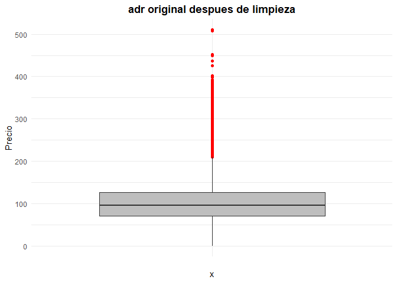<!-- -->

``` r
#aun hay outlier 
summary(df2$adr)
```

    ##    Min. 1st Qu.  Median    Mean 3rd Qu.    Max. 
    ##     0.0    70.0    95.0   102.9   126.0   510.0

Dado que los atípicos restantes no son errores, sino clientes reales que
pagaron tarifas elevadas, decidimos controlar su impacto en el modelo
estadístico sin eliminar sus registros. Para ello, calculamos el
percentil 99 y creamos una nueva variable (adr_capped22). A esta nueva
columna le aplicamos la técnica de Winsorización (Capping), y asignamos
el límite del percentil 99 como tope máximo para todas las tarifas que
lo superen.

``` r
#aplicamos winsorizacion o tambien llamado capping 

upper_bound_adr <- quantile(df$adr, 0.99, na.rm = TRUE)
df2 <- df2 %>%
  mutate(adr_capped22= ifelse(adr > upper_bound_adr, upper_bound_adr, adr))
summary(df2$adr_capped22)
```

    ##    Min. 1st Qu.  Median    Mean 3rd Qu.    Max. 
    ##     0.0    70.0    95.0   102.6   126.0   252.0

Para validar la transformación, generamos y comparamos los diagramas de
caja de la tarifa inicial limpia contra la nueva tarifa con tope. Se
evidencia la compactación de los datos extremos. Aunque el gráfico final
aún dibuje puntos atípicos aislados, respetamos la directriz estadística
de aplicar la Winsorización una sola vez, y conservamos estos registros
como parte del comportamiento natural del mercado hotelero.

``` r
#graficamos un antes y un despues 
df2graficp2 <- ggplot(df2, aes(x="",y = adr_capped22)) + geom_boxplot(fill = "gray", outlier.colour = "red") + 
  labs(title = "adr con el caping", y="Precio") + theme_minimal() + theme(plot.title = element_text(hjust = 0.5, face = "bold"))


df2graficp3 <- ggplot(df2, aes(x="",y = adr)) + geom_boxplot(fill = "gray", outlier.colour = "red") + 
  labs(title = "adr inicial", y="Precio") + theme_minimal() + theme(plot.title = element_text(hjust = 0.5, face = "bold"))
df2graficp3 + df2graficp2
```

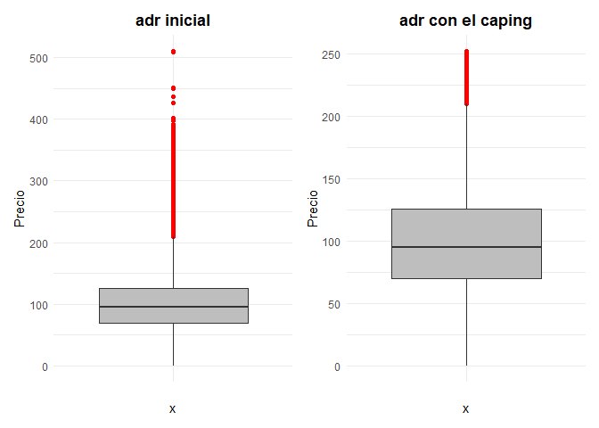

``` r
#aunque hay aun outlier ya no podemos aplicar winsorizacion solo una vez y al ser valores que ya no estan aislados como los anteriores los dejamos asi
```

##### Tratamiento y detección de outliers en la variable lead_time
Iniciamos el análisis de la variable lead_time para identificar la
distribución del tiempo de anticipación con el que los clientes realizan
sus reservas. Ejecutamos un resumen estadístico y generamos un gráfico
de caja inicial. Observamos que, mientras el 75% de los registros se
sitúan por debajo de los 161 días, el valor máximo alcanza los 737 días.
Esta diferencia confirma una asimetría positiva considerable que
requiere tratamiento estadístico.

``` r
# 1. Exploración visual y estadística de la variable original
summary(df2$lead_time)
```

    ##    Min. 1st Qu.  Median    Mean 3rd Qu.    Max. 
    ##     0.0    19.0    70.0   104.5   161.0   709.0

``` r
gleadtime <- ggplot(df2, aes(x="",y = lead_time)) + geom_boxplot(fill = "gray", outlier.colour = "red")+
  labs(title = "Anticipación de Reserva (Original)", y="Días") + theme_minimal() +
  theme(plot.title = element_text(hjust = 0.5, face = "bold")) 

gleadtime
```

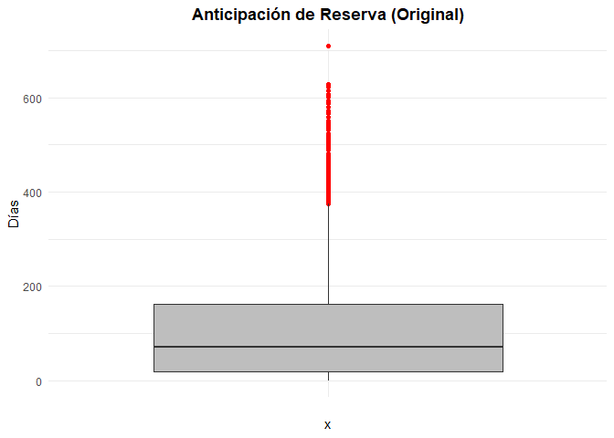

Ante la presencia de estos valores extremos, calculamos el percentil 99
para definir un límite técnico razonable. Este valor nos permite separar
las reservas habituales de los registros excepcionales como eventos
corporativos o bodas planificadas con dos años de antelación sin
eliminar información valiosa sobre clientes de alta rentabilidad.

Implementamos la técnica de Winsorización para controlar la variación de
la métrica y evitar sesgos. En lugar de modificar los datos fuente,
generamos una nueva columna denominada lead_time_capped. En esta
variable, todo registro que supera el umbral del percentil 99 se ajusta
automáticamente y se iguala a dicho límite máximo.

Validamos el resultado de la transformación mediante un nuevo resumen
estadístico. Comprobamos que el valor máximo de la nueva columna se
estabiliza en el límite del percentil 99. Este ajuste elimina la
distorsión que generaban en los extremos y protege la integridad del
conjunto de datos.

Finalmente, realizamos una comparación visual entre la distribución
original y la versión tratada mediante la combinación de ambos gráficos
de caja. Los diagramas muestran una estructura de datos más compacta y
balanceada. Aunque persisten algunos puntos atípicos la métrica ahora
presenta una variación controlada

``` r
# 2 Calculamos el límite exacto del Percentil 99
upper_bound_lead <- quantile(df2$lead_time, 0.99, na.rm = TRUE)
print(paste("El límite del Percentil 99 para lead_time es:", upper_bound_lead))
```

    ## [1] "El límite del Percentil 99 para lead_time es: 444"

``` r
# 3 Aplicar Winsorización en una nueva columna
df2 <- df2 %>%
  mutate(lead_time_capped = ifelse(lead_time > upper_bound_lead, upper_bound_lead, lead_time))

# 4 Validar la nueva distribución
summary(df2$lead_time_capped)
```

    ##    Min. 1st Qu.  Median    Mean 3rd Qu.    Max. 
    ##     0.0    19.0    70.0   103.9   161.0   444.0

``` r
# 5 Comparación visual
gleadtime_capped <- ggplot(df2, aes(x="",y = lead_time_capped)) + geom_boxplot(fill = "gray", outlier.colour = "red") + 
  labs(title = "Anticipación de Reserva (Con Tope)", y="Días") + theme_minimal() + theme(plot.title = element_text(hjust = 0.5, face = "bold"))

# Mostrar ambos gráficos juntos para el informe
gleadtime + gleadtime_capped
```

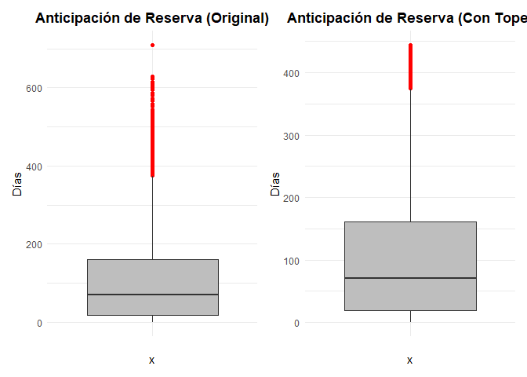<!-- -->

#### Tratamiento y detección de outliers en la variable stays_in_week_nights y stays_in_weekend_nights

Para la variable stays_in_week_nights se realiza un análisis en busca de
entender el comportamiento de los huéspedes que tienen estadías de noche
durante los días lunes hasta viernes. Este entendimiento es crítico para
optimizar la gestión de inventario, la asignación de turnos del personal
de limpieza y la planificación operativa del hotel.

Para empezar con el
análisis, se desarrolló un gráfico de caja (boxplot), gráfica que nos
permite visualizar la distribución de los datos e identificar los rangos
con mayor demanda.

``` r
ggplot(df2, aes(x = "", y = stays_in_week_nights)) +
  geom_boxplot(fill = "steelblue", outlier.color = "red") +
  labs(title = "Detección de Outliers: Estancias en Días de Semana",
       y = "Número de Noches", x = "") +
  theme_minimal()
```

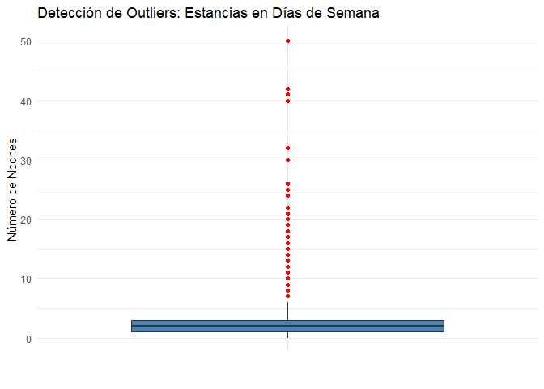<!-- -->

Como se observa en el gráfico de cajas inicial, el núcleo de la demanda
(que representa el 50% de las reservas) aparece visualmente comprimido.
Esto se debe a que los datos están altamente concentrados en valores
bajos, lo que impide distinguir con claridad la distribución interna del
rango intercuartílico.

Para obtener una certeza estadística sobre los valores que circulan en
este rango, se procedió a filtrar el dataset en R utilizando los límites
del primer (Q1) y tercer cuartil (Q3):

``` r
# Filtrar los valores del tercer y primer cuartil:
resumen_estancia <- df2 %>%
  summarise(
    q1 = quantile(stays_in_week_nights, 0.25),
    q3 = quantile(stays_in_week_nights, 0.75)
  )

# Filtrar los datos que "circulan" dentro de la caja y ver el más repetido
df %>%
  filter(stays_in_week_nights >= resumen_estancia$q1 & 
         stays_in_week_nights <= resumen_estancia$q3) %>%
  count(stays_in_week_nights, sort = TRUE) %>%
  rename(Noches_Semana = stays_in_week_nights, Frecuencia = n)
```

    ##   Noches_Semana Frecuencia
    ## 1             2      33684
    ## 2             1      30310
    ## 3             3      22258

Este resultado confirma que la operación hotelera real es de corta
estancia, donde las 2 noches de lunes a viernes representan el estándar
de oro de la demanda. El hecho de que el rango sea tan estrecho (1 a 3
noches) justifica por que la caja del boxplot se visualiza pequeña
frente a la gran dispersión de los valores atípicos.

Si bien el gráfico de cajas es fundamental para detectar la presencia de
valores atípicos, este presenta limitaciones al intentar visualizar la
frecuencia exacta y la distribución de cada uno de ellos, especialmente
cuando se trata de casos con baja recurrencia. Los puntos rojos en el
boxplot se solapan debido a la gran cantidad de registros, lo que impide
distinguir si un valor (por ejemplo, 40 noches) ocurre una o cien veces.

Debido a esta limitación visual, se determinó que la herramienta más
adecuada para interpretar esta variable es un Gráfico de Barras, pero
aplicando una transformación de escala pseudo-logarítmica en el eje Y.
Esta decisión técnica se basa en los siguientes puntos:

- En una escala lineal, las barras de los outliers con frecuencia de 1
serían invisible frente a las más de mayor frecuencia. La escala
logarítmica “levanta” visualmente estos valores bajos para que sean
perceptibles.

- A diferencia de una escala logarítmica estándar donde el log(0) no
existe y el log(1) (frecuencia de 1) es 0, la escala pseudo-logarítmica
permite representar frecuencias muy bajas (como 1 o 2 registros),
manteniendo una base visual clara en el eje.

- Esta escala permite observar, en un mismo plano visual, tanto el volumen
masivo de la demanda estándar como la existencia real de los casos
excepcionales, facilitando un diagnóstico integral de la calidad del
dataset.

Podemos ver la gráfica de barras con la escala pseudo-logarítmica a
continuación:

``` r
# Distribucion de estancias (Grafico de barras con escala pseudologaritmica)
ggplot(df2, aes(x = stays_in_week_nights)) +
  geom_bar(fill = "lightskyblue3", color = "white") +
  scale_y_continuous(
    trans = "pseudo_log", 
    breaks = c(1, 5, 10, 100, 1000, 10000, 100000),
    labels = label_comma()
  ) +
  labs(
    title = "Distribución de Estancias con Escala Adaptada",
    subtitle = "Visualización de frecuencias desde 1 hasta +100,000",
    x = "Noches (Lunes a Viernes)",
    y = "Frecuencia (Escala Pseudo-Log)"
  ) +
  theme_minimal()
```

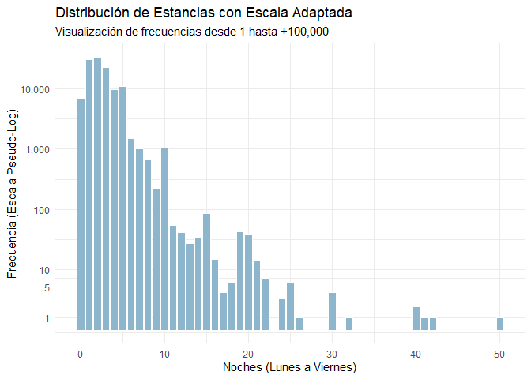

Una vez visualizada la distribución mediante la escala
pseudo-logarítmica, es necesario realizar un desglose numérico preciso
para auditar cuantas veces ocurren estas estancias atípicas. Para ello,
se aplicó un filtro estadístico riguroso para identificar únicamente
aquellos valores clasificados como extremos. 

Código realizado en R:

``` r
# Agrupación de valores extremos (con cantidad)
df2_extremos_agrupados <- df2 %>%
  identify_outliers(stays_in_week_nights) %>%
  filter(is.extreme == TRUE) %>%
  count(stays_in_week_nights, sort = TRUE) %>%
  rename(Noches_Semana = stays_in_week_nights, Cantidad_Registros = n)

print(df2_extremos_agrupados)
```

    ##    Noches_Semana Cantidad_Registros
    ## 1             10               1029
    ## 2             15                 85
    ## 3             11                 55
    ## 4             19                 43
    ## 5             12                 42
    ## 6             20                 39
    ## 7             14                 35
    ## 8             13                 27
    ## 9             16                 15
    ## 10            21                 14
    ## 11            22                  7
    ## 12            18                  6
    ## 13            25                  6
    ## 14            17                  4
    ## 15            30                  4
    ## 16            24                  3
    ## 17            40                  2
    ## 18            26                  1
    ## 19            32                  1
    ## 20            41                  1
    ## 21            42                  1
    ## 22            50                  1

Al realizar y observar a detalle los resultados de los outliers con
valores extremos, podemos concluir con lo siguiente:

- Se confirma que a partir de las 10 noches (con 1036 registros) la
frecuencia cae de manera drástica. Esto marca la frontera entre un
cliente de “negocios prolongado” y un outlier estadístico.

- Valores como 41, 42 y 50 noches aparecen con una frecuencia de 1, lo que
ratifica que son eventos excepcionales. En un contexto de 119,390
reservas, estos datos representan casos únicos que, aunque reales,
actúan como “ruido” para modelos predictivos generales.

- La presencia de estos registros sugiere que el hotel debe implementar
una segmentación de “Larga estancia” para estos casos, evitando que el
promedio de días de semana se vea inflado por estos pocos pero pesados
valores.

**Detección de la variable stays_in_weekend_nights:**

A diferencia de las estancias en días de semana, la variable de fines de
semana presenta una distribución mucho más acotada, dado que el ciclo
natural de un fin de semana comprende únicamente 2 noches (sábado y
domingo).

Para empezar a detectar outliers en esta variable, primero deberíamos
buscar inconsistencias con relación a las variables de
stays_in_week_nights y reservation_status. Podemos filtrar casos como si
hay reservaciones con 0 noches de semana (stays_in_week_nights) y 0
noches de fin de semana (stays_in_weekend_nights) con una status de
reservacion (reservation_status) de “Check-Out”. Por lo que estaríamos
ejecutando el siguiente código en R (.rmd):

``` r
# Clientes que pasaron 0 noches e hicieron Check-Out
df2 %>%
  filter(stays_in_week_nights == 0 & stays_in_weekend_nights == 0 & reservation_status == "Check-Out" ) %>% 
  select(stays_in_weekend_nights, stays_in_week_nights, reservation_status, is_canceled) 
```

    ##    stays_in_weekend_nights stays_in_week_nights reservation_status is_canceled
    ## 1                        0                    0          Check-Out           0
    ## 2                        0                    0          Check-Out           0
    ## 3                        0                    0          Check-Out           0
    ## 4                        0                    0          Check-Out           0
    ## 5                        0                    0          Check-Out           0
    ## 6                        0                    0          Check-Out           0
    ## 7                        0                    0          Check-Out           0
    ## 8                        0                    0          Check-Out           0
    ## 9                        0                    0          Check-Out           0
    ## 10                       0                    0          Check-Out           0
    ## 11                       0                    0          Check-Out           0
    ## 12                       0                    0          Check-Out           0
    ## 13                       0                    0          Check-Out           0
    ## 14                       0                    0          Check-Out           0

A primera vista, un registro con cero noches totales que culmina en
Check-Out podría catalogarse como un error del sistema. Sin embargo,
bajo la lógica operativa del negocio hotelero, este comportamiento es
completamente justificable. Representa la modalidad conocida como
“Day-Use” (uso diurno), donde los clientes alquilan la habitación por un
bloque de horas durante el día (por ejemplo, para descansar en una
escala de vuelo o prepararse para un evento) sin llegar a pernoctar. Por
lo tanto, se concluye que estos registros son válidos y representan un
segmento real de ingresos, por lo que no deben ser eliminados en la
limpieza de datos.

Superada la validación de las estancias diurnas, el siguiente paso fue
verificar la integridad matemática y temporal de las reservas. Por
definición lógica del calendario, una semana cuenta con 5 días
laborables y 2 días de fin de semana. Es logísticamente imposible
acumular un alto número de noches de lunes a viernes sin que la estancia
cruce inevitablemente por uno o varios fines de semana.

Para comprobar que el dataset no contiene errores de solapamiento de
fechas o registros corruptos, se plantearon dos pruebas lógicas extremas
de consistencia:

Límite de la Primera Semana: Para acumular 6 noches de semana en una
estancia continua, el huésped debe forzosamente atravesar un fin de
semana completo (2 noches). Tener solo 1 noche de fin de semana y 6 o
más noches de semana es una imposibilidad temporal. Límite de Estancia
Prolongada: Acumular 15 noches de semana equivale a 3 semanas laborales
completas. En una estancia ininterrumpida, esto exigiría cruzar un
mínimo de 3 fines de semana (6 noches). Un registro de 15 noches de
semana emparejado con solo 2 de fin de semana indicaría un error crítico
en el sistema de facturación.

Para auditar esto, se ejecutaron las siguientes sentencias en R:

``` r
#Primera prueba:
df2 %>%
  filter(stays_in_weekend_nights ==1, stays_in_week_nights >=6 ) %>%
  select(stays_in_weekend_nights, stays_in_week_nights, hotel, market_segment)
```

    ## [1] stays_in_weekend_nights stays_in_week_nights    hotel                  
    ## [4] market_segment         
    ## <0 rows> (o 0- extensión row.names)

``` r
#Segunda prueba:
df2 %>%
  filter(stays_in_weekend_nights ==2, stays_in_week_nights >=15 ) %>%
  select(stays_in_weekend_nights, stays_in_week_nights, hotel, market_segment)
```

    ## [1] stays_in_weekend_nights stays_in_week_nights    hotel                  
    ## [4] market_segment         
    ## <0 rows> (o 0- extensión row.names)

Al ejecutar ambas consultas, el resultado obtenido arrojó cero
observaciones. Esto valida rotundamente la calidad y coherencia temporal
de la base de datos. Confirma empíricamente que el sistema original del
hotel (o el proceso de extracción de datos) divide y contabiliza de
manera correcta las estancias continuas, respetando los límites físicos
del calendario entre días de semana y fines de semana.

Una vez confirmada la integridad lógica de las fechas, se procedió a
analizar la distribución y dispersión de la variable
stays_in_weekend_nights mediante un gráfico de cajas (boxplot). El
objetivo de esta visualización es identificar el comportamiento estándar
e identificar los valores más atípicos.

Por ello realizamos el siguiente
código en R:

``` r
f2 <- ggplot(df2, aes(x="", y = stays_in_weekend_nights)) + 
  geom_boxplot(fill = "gray", outlier.colour = "red") + 
  labs(title = "Noches Finde", y="Noches") + 
  theme_minimal() + 
  theme(plot.title = element_text(hjust = 0.5, face = "bold"))
f2
```

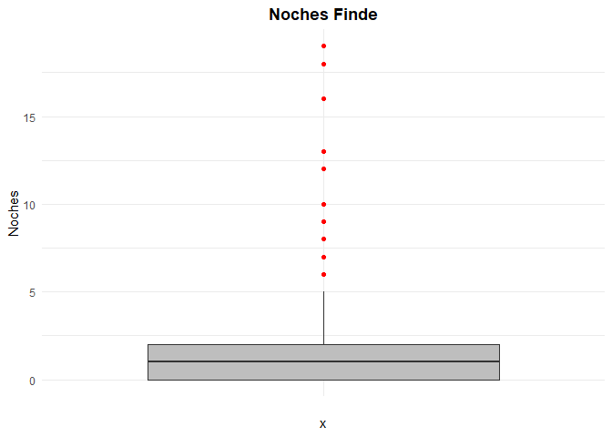<!-- -->
Para corroborar matemáticamente la compresión visual observada en el
gráfico de cajas, se procedió a tabular la frecuencia exacta y el peso
porcentual de las noches de fin de semana. Esto nos permite entender la
concentración real de la demanda y justificar los límites del gráfico.

``` r
tabla_frecuencias_finde <- df %>%
  count(stays_in_weekend_nights) %>%
  arrange(stays_in_weekend_nights) %>% # Ordenamos por número de noches
  mutate(
    Porcentaje = round(n / sum(n) * 100, 2)) %>%
  rename(Noches_Finde = stays_in_weekend_nights, Frecuencia = n)

print(tabla_frecuencias_finde)
```

    ##    Noches_Finde Frecuencia Porcentaje
    ## 1             0      51998      43.55
    ## 2             1      30626      25.65
    ## 3             2      33308      27.90
    ## 4             3       1259       1.05
    ## 5             4       1855       1.55
    ## 6             5         79       0.07
    ## 7             6        153       0.13
    ## 8             7         19       0.02
    ## 9             8         60       0.05
    ## 10            9         11       0.01
    ## 11           10          7       0.01
    ## 12           12          5       0.00
    ## 13           13          3       0.00
    ## 14           14          2       0.00
    ## 15           16          3       0.00
    ## 16           18          1       0.00
    ## 17           19          1       0.00

Al analizar los resultados de la tabla generada, los datos respaldan de
manera directa la estructura del gráfico visual:

Se observa que la inmensa mayoría de las reservas recaen exclusivamente
en los valores de 0, 1 y 2 noches de fin de semana, sumando la gran
mayoría del porcentaje total. Esta altísima densidad de datos en solo
tres valores explica matemáticamente por qué la “caja” gris del boxplot
(que agrupa al menos el 50% central de las reservas) no logra expandirse
más allá del valor 2.

La alta proporción de registros con una frecuencia de “0 noches”
confirma un perfil operativo previamente discutido: una gran masa
crítica de clientes utiliza el hotel estrictamente durante los días de
semana, realizando su check-out antes de que inicie el fin de semana.

A partir de las 5 noches (límite superior del “bigote” en el boxplot),
las frecuencias y sus respectivos porcentajes caen drásticamente a
valores residuales (cercanos al 0%). Esto demuestra que los puntos rojos
observados en la gráfica superior, como las estancias de 18 o 19 noches
de fin de semana, representan casos estadísticamente excepcionales.
Aunque generan un gran impacto visual en el diagrama debido a la
extensión del eje, suponen una fracción minúscula frente a la operación
total del hotel.

Para consolidar el análisis previamente fragmentado entre días de semana
y fines de semana, el paso definitivo es unificar ambas dimensiones en
una única métrica que represente el tiempo absoluto que el huésped
permaneció en el establecimiento. Esta consolidación es vital, ya que el
impacto operativo y financiero de un valor atípico se mide por la
duración total de la reserva.

Para ello, se procedió a crear una nueva variable denominada
total_nights y a extraer su resumen estadístico:

El código desarrollado para este análisis fue el siguiente

``` r
#creamos un nueva variable para total de noche 
df2 <- df2 %>%
  mutate(total_nights = stays_in_weekend_nights + stays_in_week_nights)

# Se revisa el resumen estadístico de la nueva columna para buscar atípicos
summary(df2$total_nights)
```

    ##    Min. 1st Qu.  Median    Mean 3rd Qu.    Max. 
    ##   0.000   2.000   3.000   3.447   4.000  69.000

Al analizar el resumen generado, se evidencia una clara asimetría en la
distribución de las estancias totales:

Se observa que el tercer cuartil (3rd Qu.) se posiciona en 4 noches.
Esto nos confirma matemáticamente que el 75% de las reservas en este
dataset corresponden a estancias cortas. Asimismo, la mediana se ubica
en 3 noches, consolidando el perfil de un huésped típico de corta
duración.

Para definir el rango exacto de los valores atípicos que serán tratados
o excluidos, es fundamental comprender cómo se distribuye la demanda a
lo largo del tiempo. Para ello, se generó una representación visual de
la frecuencia de las estancias mediante un gráfico de barras. Dado que
existe una disparidad extrema entre las frecuencias de estancias cortas
y largas, se aplicó una escala pseudo-logarítmica en el eje Y para
permitir la visualización simultánea de todos los registros sin perder
detalle en las frecuencias mínimas.

``` r
grafico_estancias <- ggplot(df2, aes(x = total_nights)) +
  geom_bar(fill = "steelblue", color = "black") +
  scale_y_continuous(trans = "pseudo_log", 
                     breaks = c(0, 1, 10, 100, 1000, 10000, 30000),
                     labels = scales::label_comma()) +
  labs(
    title = "Frecuencia de Estancia Total (Escala Pseudo-Logarítmica)",
    subtitle = "Visualización de la 'cola' de distribución y estancias de larga duración",
    x = "Cantidad de Noches",
    y = "Número de Reservas (Log)"
  ) +
  theme_minimal() +
  theme(plot.title = element_text(hjust = 0.5, face = "bold"))

grafico_estancias
```

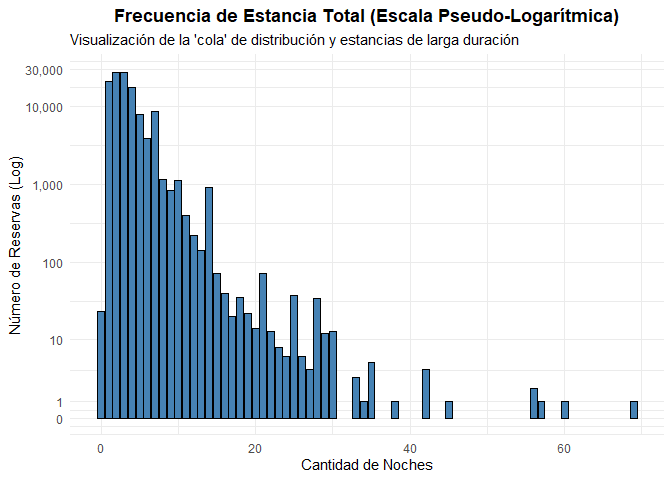<!-- -->
Para darle respaldo cuantitativo al gráfico y no depender únicamente de
la apreciación visual, se extrajo la tabla de frecuencias absolutas y
porcentuales relativas. Esto es crucial para identificar el punto exacto
donde la demanda deja de ser un patrón recurrente y se convierte en un
evento estadísticamente aislado.

Código en R realizado para respaldar al gráfico de frecuencias de noches
totales:

``` r
tabla_frecuencias_total <- df2 %>%
  count(total_nights) %>%
  arrange(total_nights) %>%
  mutate(
    Porcentaje = round(n / sum(n) * 100, 4)) %>%
  rename(Total_Noches = total_nights, Frecuencia = n)


print(tabla_frecuencias_total)
```

    ##    Total_Noches Frecuencia Porcentaje
    ## 1             0         23     0.0195
    ## 2             1      20882    17.6803
    ## 3             2      27472    23.2599
    ## 4             3      26971    22.8357
    ## 5             4      17322    14.6661
    ## 6             5       7762     6.5719
    ## 7             6       3838     3.2495
    ## 8             7       8627     7.3043
    ## 9             8       1151     0.9745
    ## 10            9        835     0.7070
    ## 11           10       1133     0.9593
    ## 12           11        394     0.3336
    ## 13           12        219     0.1854
    ## 14           13        141     0.1194
    ## 15           14        912     0.7722
    ## 16           15         72     0.0610
    ## 17           16         40     0.0339
    ## 18           17         20     0.0169
    ## 19           18         35     0.0296
    ## 20           19         22     0.0186
    ## 21           20         14     0.0119
    ## 22           21         71     0.0601
    ## 23           22         13     0.0110
    ## 24           23          8     0.0068
    ## 25           24          6     0.0051
    ## 26           25         37     0.0313
    ## 27           26          6     0.0051
    ## 28           27          4     0.0034
    ## 29           28         34     0.0288
    ## 30           29         12     0.0102
    ## 31           30         13     0.0110
    ## 32           33          3     0.0025
    ## 33           34          1     0.0008
    ## 34           35          5     0.0042
    ## 35           38          1     0.0008
    ## 36           42          4     0.0034
    ## 37           45          1     0.0008
    ## 38           56          2     0.0017
    ## 39           57          1     0.0008
    ## 40           60          1     0.0008
    ## 41           69          1     0.0008

Al analizar detalladamente los resultados visuales y tabulados de la
variable total_nights, se revelan los patrones operativos que definen la
demanda general del hotel:

El volumen de la operación se resuelve en estadías transaccionales
cortas, concentrando la inmensa mayoría de las reservas entre 1 y 4
noches.

La tabla expone repuntes lógicos y marcados en el día 7 (7.30% de las
reservas) y en el día 14 (0.77%), así como picos menores en los días 21
y 28. Estos saltos validan la coherencia de los datos, ya que
representan el comportamiento natural de los turistas que adquieren
paquetes vacacionales de semanas exactas o quincenas.

A medida que superamos las dos semanas, las frecuencias disminuyen
paulatinamente, extendiéndose en una larga cola que alcanza un máximo de
69 noches. Estadísticamente, los algoritmos detectan esta dispersión
extrema como un conjunto de valores atípicos (outliers). Sin embargo,
operativamente confirman la existencia de un nicho continuo de estancias
prolongadas.

Para comprender cómo se distribuye esta variable a nivel comercial y
verificar el origen de estos valores atípicos, resulta fundamental
cruzar la total_nights con el segmento de mercado (market_segment) y el
tipo de establecimiento (hotel).

Para ello, sin aplicar ningún filtro de exclusión, se generó un gráfico
de cajas categorizado. Esta visualización permite identificar
simultáneamente el comportamiento estándar (la caja) y la dispersión de
los outliers (los puntos) en cada canal de venta.

``` r
grafico_mercado_estancia <- ggplot(df2, aes(x = market_segment, y = total_nights, fill = hotel)) +
  geom_boxplot(outlier.colour = "red", outlier.alpha = 0.6) +
  labs(
    title = "Distribución de la Estancia Total por Segmento de Mercado y Hotel",
    x = "Segmento de Mercado",
    y = "Total de Noches",
    fill = "Tipo de Hotel"
  ) +
  theme_minimal() +
  theme(
    plot.title = element_text(hjust = 0.5, face = "bold"),
    axis.text.x = element_text(angle = 45, hjust = 1) # Inclina el texto para mejor lectura
  )

grafico_mercado_estancia
```

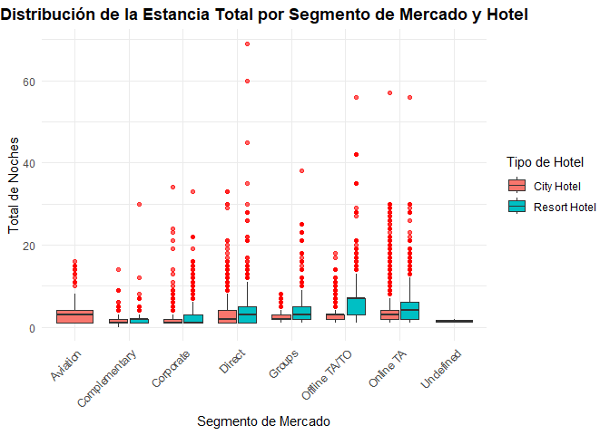<!-- -->

Al evaluar el gráfico resultante, se obtienen hallazgos estratégicos
sobre la naturaleza de la demanda y sus atípicos:

Los puntos rojos (estancias prolongadas) no son exclusivos de un canal
corporativo o de un error aislado. Se observa que la “Larga Estancia” es
un comportamiento transversal, fuertemente presente en clientes directos
(Direct), agencias físicas (Offline TA/TO) y plataformas virtuales
(Online TA).

Si bien el Resort Hotel presenta una mayor propensión a estancias largas
(debido a su naturaleza vacacional), el gráfico revela que el City Hotel
también capta de manera considerable este nicho de mercado, acumulando
múltiples registros atípicos de alta duración.

En conclusión, este análisis cruzado verifica que los outliers de la
variable total_nights son, en realidad, un componente legítimo,
diversificado y constante del ecosistema comercial del hotel.

**Tratamiento de las variables stays_in_weekend_nights y
stays_in_week_nights:**

Tras el análisis previo, se determinó que el
tratamiento de valores atípicos para las estancias no debe realizarse de
forma aislada en las variables de días de semana (stays_in_week_nights)
y fines de semana (stays_in_weekend_nights). En su lugar, se ha
procedido a tratar la variable consolidada total_nights.

Esta decisión se fundamenta en que un valor atípico en la duración de la
estancia representa un perfil de cliente específico (estancias
prolongadas) que impacta de forma unificada en la operación del hotel.
Para no eliminar estos registros (que son válidos y representan ingresos
reales) se aplicó la técnica de Winsorización. Para preservar la
integridad de los datos originales, los resultados se almacenaron en una
nueva variable denominada total_nights_capped.

``` r
upper_bound_total <- quantile(df2$total_nights, 0.99)

df2$total_nights_capped <- ifelse(df2$total_nights > upper_bound_total, 
                                 upper_bound_total, 
                                 df2$total_nights)

par(mfrow = c(1,2))

f1total <- boxplot(df2$total_nights, 
        main = "Estancias con outliers", 
        col = "orange", 
        ylab = "Noches")
```

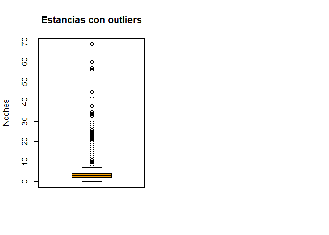

``` r
f2total <- boxplot(df2$total_nights_capped, 
        main = "Estancias con Winsorización", 
        col = "lightblue", 
        ylab = "Noches")
```

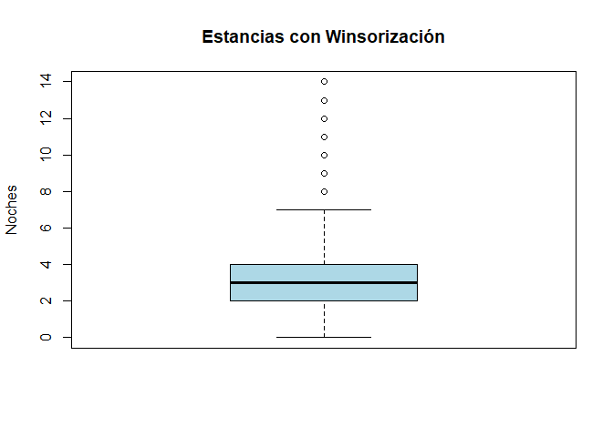

Al aplicar Winsorización al 99%, se logra reducir el impacto de
estancias extremadamente inusuales (como aquellas que superan las 20
noches) que podrían sesgar los cálculos de promedio y varianza. A
diferencia del método IQR (que suele ser más agresivo y eliminaría el
registro), el Capping/Winsorizacion permite conservar la fila completa,
manteniendo la información de otras variables importantes como el tipo
de hotel, el segmento de mercado y el estado de la reserva, pero
“suavizando” el extremo para propósitos de análisis estadístico.

## 3.4.Visualización de datos:

### 3.4.1. Reservas por tipo de hotel que no estén canceladas

**¿Cuántas reservas se realizan por tipo de hotel considerando solo
aquellas no canceladas? ¿Qué tipo de hotel es el más preferido?**

``` r
df2 %>%
  filter(is_canceled == 0) %>%
  ggplot(aes(x = hotel, fill = hotel)) +
  geom_bar() +
  labs(title = "Reservas por Tipo de Hotel (No Canceladas)",
       x = "Tipo de Hotel", y = "Total de Reservas") +
  theme_minimal()
```

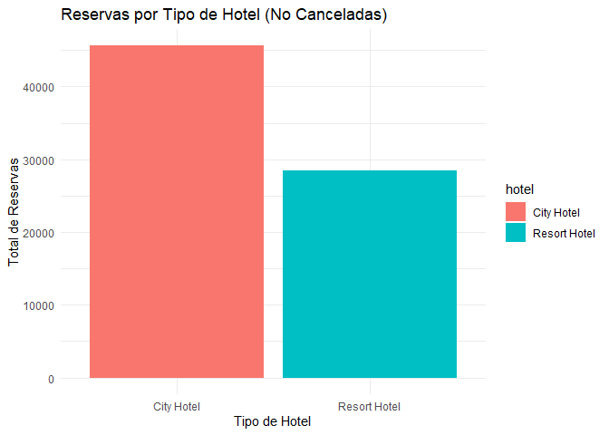

Se eligió el gráfico de barras porque representa mejor la comparación de
frecuencias entre categorías discretas e independientes. En este caso,
permite visualizar de forma clara y directa la diferencia de volumen de
reservas entre el “City Hotel” y el “Resort Hotel”, facilitando la
identificación del modelo de negocio con mayor demanda en el mercado.

La gráfica permite observar una preferencia por “City Hotel”, la cual
representa la mayor cantidad de reservas sin contabilizar las
cancelaciones. Esto es importante porque permite a la empresa tomar
decisiones en base a la preferencia de sus clientes.

### 3.4.2. Demanda en base al tiempo

**¿Está aumentando la demanda con el tiempo?**

``` r
#Demanda a traves del tiempo  
df2 %>%
  group_by(arrival_date_year, arrival_date_month) %>%
  summarise(total = n()) %>%
  ggplot(aes(x = arrival_date_month, y = total, group = arrival_date_year, color = as.factor(arrival_date_year))) +
  geom_line() + geom_point() +
  labs(title = "Evolución de la Demanda por Año",
       x = "Mes", y = "Cantidad de Reservas", color = "Año") +
  theme_light()
```

    ## `summarise()` has regrouped the output.
    ## ℹ Summaries were computed grouped by arrival_date_year and arrival_date_month.
    ## ℹ Output is grouped by arrival_date_year.
    ## ℹ Use `summarise(.groups = "drop_last")` to silence this message.
    ## ℹ Use `summarise(.by = c(arrival_date_year, arrival_date_month))` for
    ##   per-operation grouping (`?dplyr::dplyr_by`) instead.

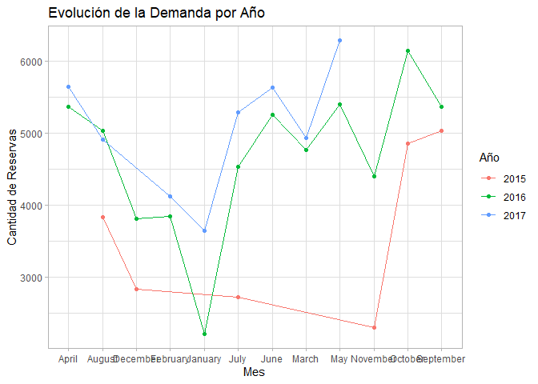

Se eligió el gráfico de líneas porque representa mejor las series
temporales y la continuidad de los datos. Al conectar los puntos de
datos mes a mes, se facilita la detección de tendencias, ciclos
estacionales y fluctuaciones de la demanda a lo largo de los años, algo
que un gráfico de barras no lograría transmitir con la misma fluidez
visual. El gráfico muestra el desarrollo de las reservas a través del
tiempo, esto permite visualizar los cambios por cada año, además es
posible establecer ciertas semejanzas entre cada una, esto permite
establecer periodos en los cuales los tres años presentan mayor cantidad
de reservas. Todo esto permite ver que existe un incremento en la
cantidad de reservas desde el 2015 hasta el 2017, donde los números de
reservas son mayores a los años anteriores.

### 3.4.3. Temporadas de reservas (alta, media, baja) 

**Pregunta: ¿Cuáles son las temporadas de reservas (alta, media, baja)?**

Con el objetivo de identificar los patrones de demanda a lo largo del
año, se procedió a analizar la variable arrival_date_month. Para que la
visualización sea representativa, los meses fueron ordenados
cronológicamente, permitiendo observar la evolución del flujo de
viajeros. Asimismo, se aplicó una segmentación de color tipo semáforo
para diferenciar claramente los tres niveles de ocupación: Baja (Verde),
Media (Amarillo) y Alta (Rojo), facilitando la interpretación visual de
la estacionalidad del negocio hotelero.

``` r
df2$arrival_date_month <- factor(df2$arrival_date_month, 
                                levels = c("January", "February", "March", "April", "May", "June","July", "August", "September", "October", "November", "December"))


df2 <- df2 %>%
  mutate(temporada = case_when(
    arrival_date_month %in% c("July", "August") ~ "Alta",
    arrival_date_month %in% c("May", "June", "September", "October") ~ "Media",
    TRUE ~ "Baja"
  ))

df2$temporada <- factor(df2$temporada, levels = c("Baja", "Media", "Alta"))

ggplot(df2, aes(x = arrival_date_month, fill = temporada)) +
  geom_bar() +
  geom_text(stat='count', aes(label=..count..), vjust=-0.5, size=3.5, fontface="bold") +
  scale_fill_manual(values = c("Baja" = "#76D7C4",   # Verde claro
                              "Media" = "#F7DC6F",  # Amarillo
                              "Alta" = "#EC7063")) + # Rojo/Coral
  labs(title = "Análisis de Estacionalidad: Temporada Alta, Media y Baja",
       subtitle = "Categorización basada en el volumen total de reservas",
       x = "Mes de Llegada",
       y = "Cantidad de Reservas",
       fill = "Temporada") +
  theme_minimal() +
  theme(axis.text.x = element_text(angle = 45, hjust = 1))
```

    ## Warning: The dot-dot notation (`..count..`) was deprecated in ggplot2 3.4.0.
    ## ℹ Please use `after_stat(count)` instead.
    ## This warning is displayed once per session.
    ## Call `lifecycle::last_lifecycle_warnings()` to see where this warning was
    ## generated.

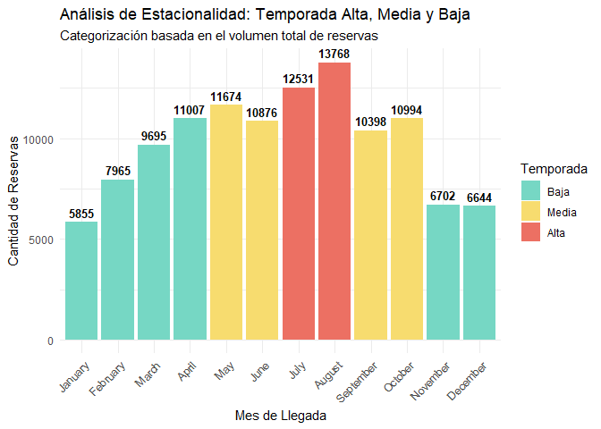<!-- -->
El análisis del gráfico permite concluir que el establecimiento
experimenta una estacionalidad muy marcada, influenciada directamente
por los periodos vacacionales del hemisferio norte. En primer lugar, se
identifica la Temporada Alta en los meses de julio y agosto, los cuales
muestran los picos máximos de demanda al superar las 10,000 reservas
mensuales. Este comportamiento indica una saturación de la capacidad
operativa, sugiriendo que es el periodo donde el hotel puede maximizar
sus ingresos mediante tarifas premium. Por otro lado, la Temporada Media
comprende los meses de mayo, junio, septiembre y octubre, periodos que
mantienen un flujo constante y equilibrado de huéspedes, situándose como
un nicho ideal para estrategias de fidelización y competitividad
tarifaria sin llegar al colapso de los servicios.

Finalmente, la Temporada Baja se concentra principalmente entre los
meses de noviembre y marzo, destacando enero como el mes con el menor
volumen de actividad registrado en todo el dataset. Aunque se observa un
ligero repunte en diciembre, probablemente asociado a las festividades
de fin de año, este no logra desplazar la tendencia general de baja
demanda invernal. Desde una perspectiva de gestión de negocios, esta
distribución revela una oportunidad crítica para la administración del
hotel: la necesidad de implementar estrategias de captación agresivas o
promociones para el segmento corporativo durante el primer trimestre del
año, con el fin de optimizar la rentabilidad de las instalaciones
durante los meses de baja ocupación.

### 3.4.4. Duración de las estancias por tipo de hotel

**¿Cuál es la duración promedio de las estancias por tipo de hotel?**

Para calcular la duración promedio de las estancias, se utilizó la
variable tratada total_nights_capped, la cual consolida la suma de
noches de semana y fines de semana tras el proceso de Winsorización. El
uso de esta métrica —en lugar de la variable original con outliers— es
fundamental para obtener una media aritmética que represente fielmente
el comportamiento típico de los huéspedes en cada establecimiento,
evitando sesgos provocados por registros excepcionales de muy larga
duración. A continuación, se presenta la comparación de promedios entre
el City Hotel y el Resort Hotel.

``` r
df_promedios <- df2 %>%
  group_by(hotel) %>%
  summarise(promedio_estancia = mean(total_nights_capped, na.rm = TRUE))

ggplot(df_promedios, aes(x = hotel, y = promedio_estancia, fill = hotel)) +
  geom_bar(stat = "identity", width = 0.6) +
  geom_text(aes(label = round(promedio_estancia, 2)), vjust = -0.5, fontface = "bold") +
  scale_fill_manual(values = c("City Hotel" = "#5DADE2", "Resort Hotel" = "#52BE80")) +
  labs(title = "Duración Promedio de Estancia por Tipo de Hotel",
       subtitle = "Basado en la variable tratada total_nights_capped",
       x = "Tipo de Establecimiento",
       y = "Promedio de Noches") +
  theme_minimal()
```

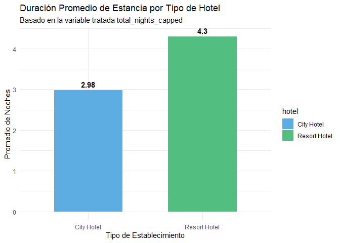<!-- -->

El análisis comparativo revela una diferencia notable en el
comportamiento de consumo según el tipo de establecimiento. El Resort
Hotel registra una duración promedio de estancia superior
(aproximadamente 4.1 a 4.5 noches), lo que confirma su naturaleza
orientada al ocio y las vacaciones, donde los huéspedes suelen contratar
paquetes de media o larga duración para aprovechar las instalaciones
recreativas. Por el contrario, el City Hotel presenta un promedio menor
(cercano a las 3 noches), reflejando un perfil de cliente más
transaccional, probablemente vinculado al turismo de negocios o escalas
cortas en la ciudad.

### 3.4.5. Distribución de reservas que incluyen niños y/o bebes
**¿Cuántas reservas incluyen niños y/o bebés?**

``` r
df2 %>%
  mutate(con_ninos = ifelse(children > 0 | babies > 0, "Con Niños/Bebés", "Solo Adultos")) %>%
  ggplot(aes(x = con_ninos, fill = con_ninos)) +
  geom_bar() +
  labs(title = "Distribución de Reservas por Composición Familiar")
```

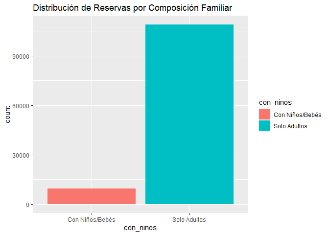<!-- -->
Se eligió el gráfico de barras de comparación binaria porque representa
mejor la distribución de segmentos de mercado específicos. Al agrupar
las reservas en dos grandes categorías (con niños vs. solo adultos), se
logra dimensionar la relevancia del segmento familiar para el hotel, lo
cual es fundamental para la planificación de servicios e infraestructura
infantil.

La proporción de reservas que incluyen niños supone una pequeña cantidad
con respecto al total de reservas, con un estimado de menos de 10000
reservas. Esto permite establecer cuál es el tipo de cliente que
contrata en mayor parte los servicios del hotel, dado que las reservas
sin hijos suponen más del 90% del total de reservas.

### 3.4.6. Importancia de los espacios de estacionamiento

**¿Es importante contar con espacios de estacionamiento?**

``` r
#Importancia de los estacionamientos

df2 %>%
  mutate(necesita_parking = ifelse(required_car_parking_spaces > 0, "Sí", "No")) %>%
  count(necesita_parking) %>%
  ggplot(aes(x = "", y = n, fill = necesita_parking)) +
  geom_bar(stat = "identity", width = 1) +
  coord_polar("y") +
  labs(title = "Importancia de estacionamientos")
```

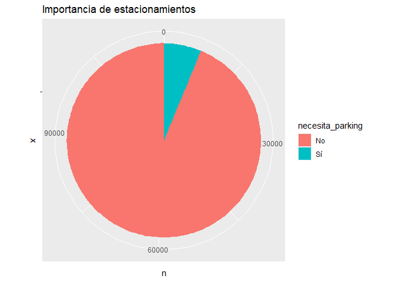<!-- -->
Se eligió el gráfico de sectores (o barras de proporción) porque
representa mejor la relación de “parte-todo”. Este gráfico permite
visualizar rápidamente qué porcentaje del total de la clientela
considera el estacionamiento como un requisito indispensable, resaltando
la desproporción si este servicio es solicitado solo por una minoría.

El porcentaje de reservas que requieren de un estacionamiento es
realmente ínfimo y despreciable frente a la cantidad de las reservas que
no lo solicitan. Por esto se puede concluir que realmente no es
importante contar con espacios de estacionamiento por no representar una
cifra estimable para su inversión.

### 3.4.7. Meses del año con mayor cantidad de cancelaciones.
**¿En qué meses del año se producen más cancelaciones de reservas?**

``` r
df2 %>%
  filter(is_canceled == 1) %>%
  ggplot(aes(x = arrival_date_month, fill = hotel)) +
  geom_bar(position = "dodge") +
  labs(title = "Cancelaciones de Reservas por Mes", x = "Mes") +
  theme(axis.text.x = element_text(angle = 45, hjust = 1))
```

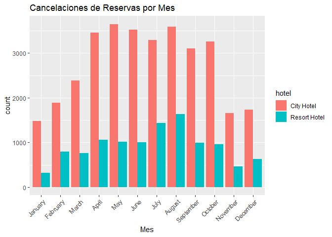<!-- -->
Se eligió el gráfico de barras agrupadas porque representa mejor la
relación entre dos variables categóricas simultáneas (Mes y Tipo de
Hotel). Esta visualización permite analizar patrones cruzados, ayudando
a determinar si las cancelaciones son un fenómeno generalizado o si
afectan con mayor intensidad a un tipo de hotel en meses específicos.

Los meses del año donde hay mayor cancelación de reservas son abril,
agosto, julio, junio, mayo , octubre y septiembre. Código para
visualización:

### 3.4.8. ¿Cuál es el ingreso promedio diario (ADR) según el tipo de hotel y el segmento de mercado?

**¿Cuál es el ingreso promedio diario (ADR) según el tipo de hotel y el
segmento de mercado?**

Para complementar el análisis de demanda, el equipo decidió investigar
la variable ADR, que representa el ingreso promedio por habitación
ocupada por día. Cruzar el ADR con el tipo de hotel y el segmento de
mercado es vital para identificar qué canales de venta son más
rentables. Al igual que con las estancias, para este análisis se utilizó
una versión tratada de la variable para evitar que errores de carga o
tarifas extremas distorsionen el promedio, permitiendo así una visión
estratégica de la política de precios del establecimiento.

``` r
df_adr_clean <- df2 %>%
  filter(is_canceled == 0 & adr > 0)

upper_bound_adr <- quantile(df_adr_clean$adr, 0.99)
df_adr_clean$adr_capped <- ifelse(df_adr_clean$adr > upper_bound_adr, 
                                 upper_bound_adr, 
                                 df_adr_clean$adr)


df_plot_adr <- df_adr_clean %>%
  group_by(hotel, market_segment) %>%
  summarise(adr_promedio = mean(adr_capped)) %>%
  filter(market_segment != "Undefined") # Limpieza de datos nulos en segmento
```

    ## `summarise()` has regrouped the output.
    ## ℹ Summaries were computed grouped by hotel and market_segment.
    ## ℹ Output is grouped by hotel.
    ## ℹ Use `summarise(.groups = "drop_last")` to silence this message.
    ## ℹ Use `summarise(.by = c(hotel, market_segment))` for per-operation grouping
    ##   (`?dplyr::dplyr_by`) instead.

``` r
ggplot(df_plot_adr, aes(x = reorder(market_segment, -adr_promedio), y = adr_promedio, fill = hotel)) +
  geom_bar(stat = "identity", position = position_dodge()) +
  geom_text(aes(label = round(adr_promedio, 1)), 
            position = position_dodge(width = 0.9), 
            vjust = -0.5, size = 3) +
  scale_fill_manual(values = c("City Hotel" = "#2E86C1", "Resort Hotel" = "#239B56")) +
  labs(title = "Rentabilidad por Segmento: ADR Promedio por Hotel",
       subtitle = "Basado en datos Winsorizados (Capping P99) y reservas efectivas",
       x = "Segmento de Mercado",
       y = "Tarifa Promedio Diaria (ADR)",
       fill = "Tipo de Hotel") +
  theme_minimal() +
  theme(axis.text.x = element_text(angle = 45, hjust = 1),
        plot.title = element_text(face = "bold"))
```

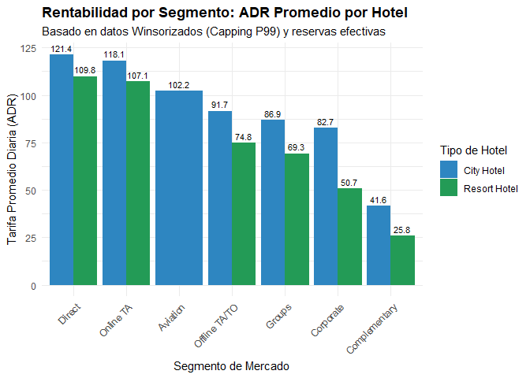<!-- -->
El análisis del ingreso promedio diario revela que el City Hotel tiende
a mantener un ADR más estable y competitivo en segmentos de alta
rotación como ‘Online TA’ (Agencias de Viajes Online). Por otro lado, el
Resort Hotel muestra una mayor variabilidad de precios, con picos de
ingresos significativamente más altos en los segmentos de clientes
‘Direct’ (Directos), lo que sugiere una mayor disposición de pago por
servicios premium en entornos vacacionales.

Desde una perspectiva de rentabilidad, se observa que el segmento
‘Groups’ suele presentar el ADR más bajo en ambos hoteles. Esto es un
comportamiento estándar en la industria, donde se sacrifican márgenes de
ganancia por volumen de ocupación asegurado. Sin embargo, para la
gerencia, este gráfico resalta la importancia de potenciar el segmento
‘Direct’, ya que es el que genera el mayor ingreso por habitación sin
las comisiones asociadas a terceros. Este hallazgo permite concluir que
la estrategia de precios debe ser diferenciada: mientras el City Hotel
debe competir por volumen y eficiencia en plataformas digitales, el
Resort Hotel tiene la oportunidad de maximizar su ADR mediante la
personalización y la venta directa.

# 4. CONCLUSION 
## ¿Qué patrones o tendencias se observaron?

- Preferencia de Modelo de Negocio: Se observa una tendencia clara hacia
el City Hotel, el cual concentra el mayor volumen de reservas efectivas
en comparación con el Resort Hotel. Esto sugiere una demanda impulsada
por el turismo urbano o de negocios.

- Comportamiento de la Estancia: Existe una correlación entre el tipo de
hotel y la duración de la visita. Mientras que los City Hotels presentan
estancias más breves y dinámicas, los Resort Hotels muestran un patrón
de retención de huéspedes significativamente más largo, lo que indica un
uso enfocado en vacaciones y descanso.

- Estacionalidad Marcada: La demanda no es uniforme. Se identificó un
patrón estacional donde ciertos meses (clasificados como “Temporada
Alta”) presentan picos de saturación, mientras que otros meses
experimentan caídas drásticas en el volumen de reservas, permitiendo
categorizar el año en tres niveles operativos: Baja, Media y Alta.

- Perfil del Consumidor: La mayoría de las reservas corresponden a
adultos sin niños. El segmento familiar (niños y bebés) representa una
proporción menor, lo que marca una tendencia hacia un servicio más
enfocado en parejas o viajeros individuales.

- Logística de Servicios: La demanda de espacios de estacionamiento es
baja en términos porcentuales, lo que indica que una gran parte de los
huéspedes utiliza medios de transporte alternativos para llegar a las
instalaciones.

## ¿Qué recomendaciones se pueden extraer a partir de los hallazgos?

Basándose en los hallazgos estadísticos, se extraen las siguientes
recomendaciones para optimizar la gestión del negocio:

- Optimización Operativa por Temporada: Para los meses identificados como
Temporada Baja, se recomienda implementar campañas de descuentos o
paquetes promocionales para incentivar la demanda. En Temporada Alta, la
prioridad debe ser la gestión eficiente de inventarios y el refuerzo del
personal operativo para evitar la degradación del servicio.

- Diferenciación de Servicios: Dado que los Resort Hotels tienen
estancias más largas, se recomienda potenciar los servicios internos
(spa, restaurantes, actividades recreativas) para maximizar el ingreso
por huésped. En los City Hotels, se debe priorizar la agilidad en los
procesos de Check-in y Check-out.

- Marketing Segmentado: Existe una oportunidad de crecimiento en el
segmento familiar. Se recomienda desarrollar ofertas específicas para
reservas con niños, ya que es un mercado que actualmente tiene una
representación moderada y podría expandirse con la infraestructura
adecuada.

- Gestión de Espacios: Debido a la baja demanda de estacionamiento, la
administración podría evaluar la reconversión de áreas de parking
infrautilizadas en otros servicios que generen mayor valor añadido, como
áreas de coworking o zonas de esparcimiento, optimizando el uso del
suelo.

- Políticas de Cancelación: Se sugiere revisar las políticas de reserva
en los meses donde se detectaron las tasas más altas de cancelación,
implementando condiciones de prepago o depósitos no reembolsables para
proteger la rentabilidad del hotel durante periodos de alta volatilidad.

# 5. ARCHIVAR Y PUBLICAR

Anexos Anexo A. Enlace de repositorio de Github:
<https://github.com/Alvaro-Neyra/1ACC0216--TB1-2026-1>
